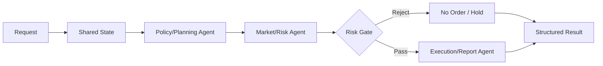

# Coin Agent AI / Agent 개발 명세

## 문서 목적

이 문서는 LangGraph 기반 통합 AI 오케스트레이터와 각 Agent가 Binance Spot Testnet 기반 데이터와 주문 결과를 어떻게 처리하는지 정의한다.

## 관련 문서

- 요구사항: `SPEC.md`
- 시스템 구조: `ARCHITECTURE.md`
- 데이터 계약: `DATA.md`

## 1. AI 계층의 역할

AI 계층은 Binance Spot Testnet의 시세, 잔고, 주문 결과를 바탕으로 사용자의 테스트 요청을 구조화하고, 주문 가능 여부를 판단하며, 결과를 설명하는 역할을 한다.

## 2. 통합 Orchestrator 구조

## 3. Agent 정의

### 3.1 Policy / Planning Agent

- 사용자의 Testnet 주문 테스트 요청을 구조화한다.
- `symbol`, `side`, `type`, `quantity`, `quoteOrderQty`, `price`, `timeInForce`를 검증용 상태로 정리한다.

### 3.2 Market / Risk Agent

- 현재가, 호가, 캔들, 잔고, 거래 가능 여부를 해석한다.
- 잘못된 심볼, 최소 수량 미충족, 필수 파라미터 누락을 차단한다.

### 3.3 Execution / Report Agent

- 주문 응답, 상태 조회 결과, 취소 결과를 사람이 이해할 수 있게 설명한다.
- 에러 코드와 실패 원인을 자연어로 요약한다.

## 4. Shared State 정의

- `request_context`
- `symbol`
- `market_snapshot`
- `account_balance`
- `risk_assessment`
- `order_request`
- `order_response`
- `order_status`
- `cancel_response`
- `stream_event`
- `errors`

## 5. 노드 입력/출력 기준

| 노드 | 입력 | 출력 |
|---|---|---|
| Policy Node | 사용자 요청 | 구조화 주문 요청 |
| Risk Node | 구조화 주문 요청, 시장 데이터, 잔고 | 주문 허용/차단 결과 |
| Execution Node | 허용된 주문 요청 | 주문 응답 |
| Report Node | 주문 응답/상태/취소 결과 | 설명 가능한 결과 |

## 6. 리스크 게이트 기준

- 심볼 형식이 Binance Spot 심볼 규칙을 만족하는가
- `MARKET` / `LIMIT` 타입별 필수 파라미터가 있는가
- 잔고가 충분한가
- 실거래 URL 또는 실거래 키가 사용되지 않았는가
- API 실패 또는 서명 실패가 발생하지 않았는가

하나라도 실패하면 기본값은 무주문 또는 판단 보류다.

## 7. LLM 사용 지점과 룰 엔진 사용 지점

### LLM 사용 지점

- 주문 결과 설명
- 에러 해석 요약
- 테스트 리포트 생성

### 룰 엔진 사용 지점

- 필수 파라미터 검증
- 심볼 형식 검증
- 주문 타입별 필수 필드 검증
- 실거래 URL/키 차단

## 8. 프롬프트 원칙

- Binance Spot Testnet 전용이라는 사실을 항상 전제한다.
- 실거래로 오해될 수 있는 표현을 쓰지 않는다.
- 수익 보장, 매수 유도, 공격적 투자 표현을 쓰지 않는다.
- 주문 결과와 실패 사유를 분리해 설명한다.
- 불확실하면 주문을 생성하지 않는다.

## 9. 실패 처리 기본값

- 파라미터 누락: 무주문
- 시그니처 실패: 무주문
- 잔고 부족: 무주문
- API 실패: 무주문
- stream 실패: 수동 조회 fallback 안내

## 10. 평가 기준

- 요청 구조화 정확성
- 파라미터 차단 정확성
- 주문 결과 설명의 명확성
- 에러 코드 해석 일관성
- 실거래 방지 문구 유지 여부

## 11. 확정 구현 기준

- 자연어 정책 입력은 제외하고 폼/구조화 입력만 지원한다.
- 주문 허용 판단은 룰 엔진 우선으로 처리한다.
- AI는 설명과 요약에 집중하고, 거래소 시그니처 생성은 하지 않는다.
