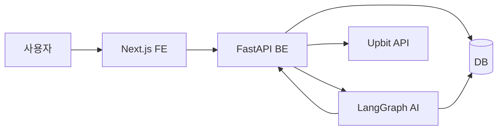
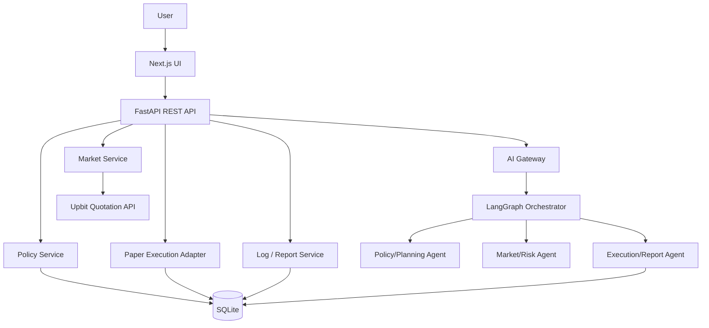
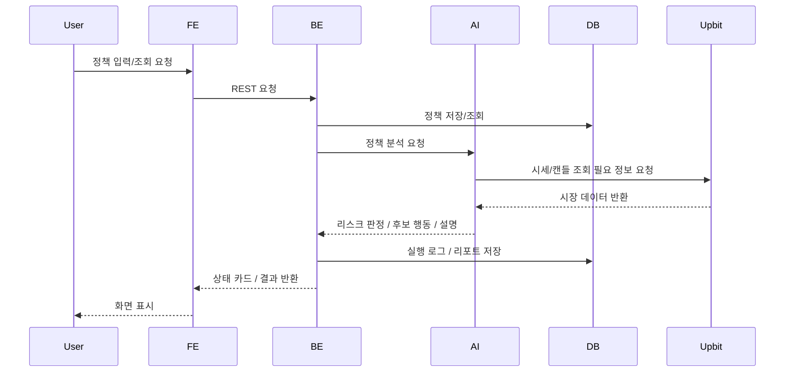

# Coin Agent 시스템 아키텍처

## 문서 목적

이 문서는 Coin Agent MVP의 전체 시스템 구조와 FE/BE/AI/DB/외부 API의 책임 경계를 정의한다. 이 문서는 구조와 흐름을 설명하며, 세부 계약은 `DATA.md`를 기준으로 한다.

## 관련 문서

- 요구사항: `SPEC.md`
- 데이터 계약: `DATA.md`
- FE 구현 기준: `FE.md`
- BE 구현 기준: `BE.md`
- AI 구현 기준: `AI.md`

## 1. 아키텍처 개요

Coin Agent는 다음 다섯 계층으로 구성된다.

1. Next.js 기반 Frontend
2. FastAPI 기반 Backend API
3. LangGraph 기반 AI Orchestrator
4. DB 저장소
5. Upbit API

핵심 원칙은 다음과 같다.

- FE는 입력과 시각화에 집중한다.
- BE는 시스템 API, 저장, Upbit 연동, 페이퍼 실행 어댑터를 담당한다.
- AI는 정책 해석, 리스크 판단, 실행 요약을 담당한다.
- 정책과 리스크 게이트를 통과하지 못하면 기본값은 무거래 또는 판단 보류다.
- 실제 자동매매가 아니라 페이퍼 실행 중심 MVP다.

## 2. 시스템 관계도

## 3. 상세 아키텍처

## 4. 책임 경계

| 계층 | 책임 | 하지 않는 일 |
|---|---|---|
| FE | 정책 입력, 상태 카드, 자동 대응 카드, 로그/리포트 UI | 거래소 직접 호출, 정책 판정, 주문 실행 |
| BE | 정책 저장/조회, 업비트 조회, 페이퍼 실행 어댑터, 로그/리포트 저장, AI 호출 | UI 렌더링, 프롬프트 생성의 최종 책임 |
| AI | 정책 해석, 지표 해석, 리스크 게이트, 실행 설명, 리포트 생성 | 실거래 실행, 브라우저 렌더링 |
| DB | 정책, 로그, 리포트, 실행 기록 저장 | 비즈니스 판단 |
| Upbit API | 시세 및 캔들 데이터 제공 | 내부 정책/리스크 판단 |

## 5. 핵심 흐름

### 5.1 정책 입력 → 시장 조회 → 리스크 판단 → 페이퍼 실행 → 리포트

### 5.2 단계 설명

1. 사용자가 정책을 저장하거나 현재 상태 조회를 요청한다.
2. BE는 정책을 저장/조회하고 AI 오케스트레이터 호출 조건을 결정한다.
3. AI는 정책 객체와 시장 데이터를 기반으로 리스크 게이트를 판정한다.
4. 실행 허용 시에도 실제 주문은 하지 않고 페이퍼 실행만 수행한다.
5. 결과는 로그와 리포트로 저장되고 FE에 구조화 응답으로 전달된다.

## 6. 장애 및 예외 기본 원칙

- 외부 데이터가 불완전하거나 실패하면 신규 실행을 차단한다.
- 정책 검증 실패 시 기본값은 무거래 또는 판단 보류다.
- AI 응답이 스키마를 벗어나면 룰 엔진 재검증 후 실패로 처리한다.
- DB 저장 실패 시 실행 결과를 성공으로 표시하지 않는다.
- UI는 마지막 정상 상태와 현재 오류 상태를 함께 보여준다.

## 7. 신뢰 경계 및 보안 관점

- 브라우저는 Upbit API를 직접 호출하지 않는다.
- 업비트 시세 API와 LLM API 키는 서버 측 환경 변수로만 관리한다.
- MVP에서는 업비트 private API를 사용하지 않으며, 페이퍼 실행은 내부 어댑터로만 처리한다.
- 로그에는 민감 정보 원문을 남기지 않는다.

## 8. 확정 구현 기준

- DB는 로컬 개인용 Agent 기준으로 SQLite를 사용한다.
- AI 서비스 인터페이스는 MVP에서 HTTP만 사용한다.
- 데모는 업비트 실시간 시세/캔들 API를 사용하고 실행은 페이퍼 실행으로 유지한다.
- 배치 스케줄러는 후순위로 두고, MVP에서는 요청 기반 흐름과 간단한 주기성 감시만 반영한다.
- AI는 별도 서비스가 아니라 BE 내부 프로세스로 실행한다.
- 시세 캐시 계층은 두지 않고, 요청 시점 조회를 기본으로 한다.
- 야간 자동 감시는 배치 작업 대신 요청 기반 시뮬레이션으로 처리한다.
