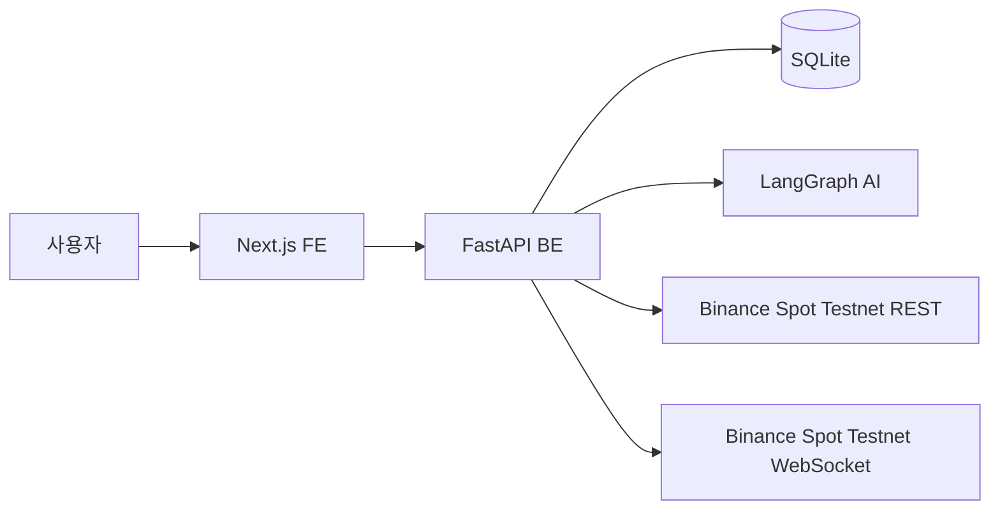
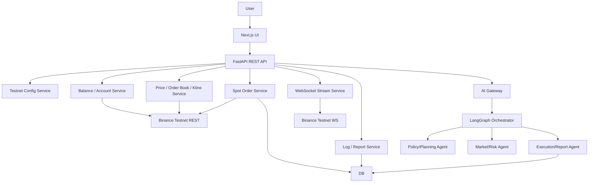
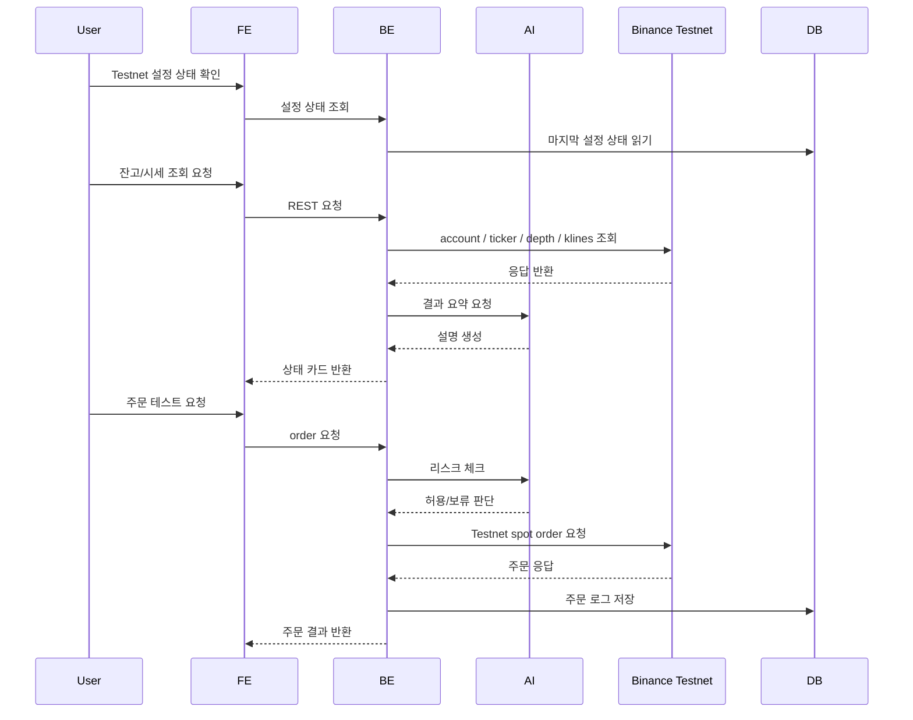
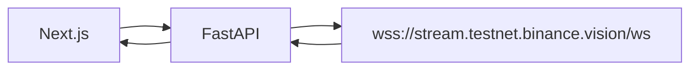

# Coin Agent 시스템 아키텍처

## 문서 목적

이 문서는 Coin Agent MVP의 전체 시스템 구조와 FE/BE/AI/DB/Binance Spot Testnet의 책임 경계를 설명한다. 이 프로젝트는 **Binance Spot Testnet 전용 가상 자금 현물 주문 테스트** 구조를 가진다.

## 관련 문서

- 요구사항: `SPEC.md`
- 데이터 계약: `DATA.md`
- FE 구현 기준: `FE.md`
- BE 구현 기준: `BE.md`
- AI 구현 기준: `AI.md`

## 1. 아키텍처 개요

Coin Agent는 다음 다섯 계층으로 구성된다.

1. Next.js 기반 Frontend
2. FastAPI 기반 Backend API
3. LangGraph 기반 AI Orchestrator
4. SQLite 저장소
5. Binance Spot Testnet REST / WebSocket

핵심 원칙은 다음과 같다.

- FE는 입력과 시각화에 집중한다.
- BE는 Binance Spot Testnet REST/WebSocket 연동과 시그니처 처리, 주문 테스트 흐름을 담당한다.
- AI는 요청 해석, 리스크 게이트, 결과 설명을 담당한다.
- 실거래는 다루지 않는다.
- API 호출은 모두 Testnet 환경에서만 수행한다.
- API Key/Secret은 서버 환경 변수에만 저장한다.

## 2. 시스템 관계도

## 3. 상세 아키텍처

## 4. 책임 경계

| 계층 | 책임 | 하지 않는 일 |
|---|---|---|
| FE | 환경 변수 설정 상태 확인, 잔고/시세/주문 화면, 상태 시각화 | Binance 직접 호출, 시그니처 생성, API Key 원문 처리 |
| BE | REST/WebSocket 연동, 시그니처 생성, 주문 요청, 상태 조회, 취소 | 브라우저 렌더링, 실거래 전송 |
| AI | 요청 해석, 리스크 게이트, 결과 설명 | Binance 직접 서명 요청, 실거래 전략 운용 |
| DB | 환경 설정, 요청 로그, 주문 로그, 리포트 저장 | 시장 데이터의 영구 원본 저장 |
| Binance Spot Testnet | 가상 자금 기반 현물 API/WS 제공 | 내부 정책 판단 |

## 5. 핵심 흐름

### 5.1 설정 상태 확인 → 잔고 조회 → 시세 조회 → 주문 테스트 → 상태 확인 → 취소

### 5.2 WebSocket 시세 수신 흐름

## 6. 장애 및 예외 기본 원칙

- Testnet REST 실패 시 신규 주문 테스트를 중단한다.
- 잔고 조회 실패 시 주문 화면에서 주문 요청을 차단한다.
- 시그니처 생성 실패 시 즉시 에러를 반환한다.
- WebSocket 연결 실패 시 수동 조회 fallback을 사용한다.
- 실거래 URL 또는 잘못된 API Key 사용이 감지되면 즉시 실행을 차단한다.

## 7. 신뢰 경계 및 보안 관점

- 브라우저는 Binance Testnet REST/WS를 직접 호출하지 않는다.
- API Key/Secret은 서버 측 환경 변수로만 보관한다.
- BE만 `timestamp`, `signature`, `X-MBX-APIKEY`를 처리한다.
- 실거래 host 문자열은 설정값과 문서에서 금지한다.
- FE는 API Key/Secret 원문을 입력받거나 저장하지 않는다.

## 8. 확정 구현 기준

- REST Base URL은 `https://testnet.binance.vision/api`로 고정한다.
- WebSocket Streams URL은 `wss://stream.testnet.binance.vision/ws`로 고정한다.
- WebSocket API URL은 `wss://ws-api.testnet.binance.vision/ws-api/v3`로 고정한다.
- AI는 BE 내부 프로세스가 아니라 별도 HTTP 서비스로 두되, 로컬 동일 머신에서만 실행한다.
- 주문 예시는 Spot 현물 시장가/지정가만 다룬다.
- orderbook은 `depth` snapshot 기준으로 정의한다.
