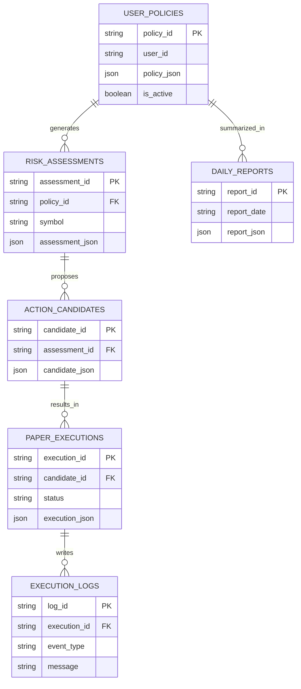

# Coin Agent 데이터 / API 계약 통합 문서

## 문서 목적

이 문서는 API 계약, 주요 데이터 모델, DB 초안, ERD를 하나의 문서로 통합 관리한다. 별도 `API_CONTRACT.md`, `DATA_MODEL.md`, `ERD.md`는 만들지 않는다.

## 관련 문서

- 요구사항: `SPEC.md`
- 시스템 구조: `ARCHITECTURE.md`
- FE/BE/AI 구현 기준: `FE.md`, `BE.md`, `AI.md`

## 1. 도메인 용어

| 용어 | 설명 |
|---|---|
| 사용자 정책 | 사용자가 사전에 설정한 코인, 한도, 자동 대응 규칙 |
| MarketSnapshot | 특정 시점의 시장 상태와 기본 지표 요약 |
| RiskAssessment | 정책 대비 현재 위험 상태와 실행 가능 여부 |
| ActionCandidate | 시스템이 생성한 자동 대응 후보 |
| PaperExecution | 실제 자금 이동 없는 모의 실행 결과 |
| ExecutionLog | 실행/보류 기록 |
| DailyReport | 하루 기준 요약 리포트 |
| ErrorResponse | 공통 오류 응답 객체 |

## 2. 주요 데이터 객체

### 2.1 UserPolicy

```json
{
  "policy_id": "pol_001",
  "user_id": "demo_user",
  "coins": ["BTC", "ETH"],
  "stop_loss_pct": 3.0,
  "take_profit_pct": 5.0,
  "max_order_amount_krw": 50000,
  "daily_loss_limit_pct": 3.0,
  "allowed_buy_coins": ["BTC"],
  "auto_rules": [
    {
      "rule_id": "rule_drop_01",
      "condition": "price_drop_pct >= 5",
      "action": "reduce_position"
    }
  ],
  "active_time_window": {
    "start": "22:00",
    "end": "07:00"
  },
  "is_active": true,
  "created_at": "2026-05-04T22:00:00+09:00",
  "updated_at": "2026-05-04T22:10:00+09:00"
}
```

### 2.2 사용자 정책 JSON 스키마

```json
{
  "$schema": "https://json-schema.org/draft/2020-12/schema",
  "title": "UserPolicy",
  "type": "object",
  "required": [
    "coins",
    "stop_loss_pct",
    "take_profit_pct",
    "max_order_amount_krw",
    "daily_loss_limit_pct",
    "auto_rules"
  ],
  "properties": {
    "coins": {
      "type": "array",
      "items": { "type": "string" },
      "minItems": 1
    },
    "stop_loss_pct": { "type": "number", "minimum": 0 },
    "take_profit_pct": { "type": "number", "minimum": 0 },
    "max_order_amount_krw": { "type": "number", "exclusiveMinimum": 0 },
    "daily_loss_limit_pct": { "type": "number", "minimum": 0 },
    "allowed_buy_coins": {
      "type": "array",
      "items": { "type": "string" }
    },
    "auto_rules": {
      "type": "array",
      "items": {
        "type": "object",
        "required": ["rule_id", "condition", "action"],
        "properties": {
          "rule_id": { "type": "string" },
          "condition": { "type": "string" },
          "action": { "type": "string" }
        }
      }
    }
  }
}
```

### 2.3 MarketSnapshot

```json
{
  "symbol": "BTC",
  "timestamp": "2026-05-04T09:00:00+09:00",
  "current_price": 98000000,
  "change_24h_pct": -4.8,
  "rsi": 31.2,
  "ma_20": 99500000,
  "ma_60": 101000000,
  "volatility_pct": 5.4
}
```

### 2.4 RiskAssessment

```json
{
  "symbol": "BTC",
  "risk_level": "warning",
  "gate_passed": false,
  "matched_conditions": ["price_drop_near_limit"],
  "blocked_reasons": ["daily_loss_limit_near_exceeded"],
  "summary": "손실 한도에 가까워 자동 실행이 보류되었습니다."
}
```

### 2.5 ActionCandidate

```json
{
  "candidate_id": "act_001",
  "symbol": "BTC",
  "action": "reduce_position",
  "confidence_label": "rule_based",
  "execution_allowed": false,
  "reason": "급락 감지되었으나 일일 손실 한도 조건으로 실행 보류",
  "risk_note": "추가 하락 가능성 대비 관망 권장"
}
```

### 2.6 PaperExecution

```json
{
  "execution_id": "pex_001",
  "candidate_id": "act_001",
  "symbol": "BTC",
  "action": "reduce_position",
  "status": "blocked",
  "simulated_price": 97800000,
  "simulated_amount_krw": 50000,
  "blocked_reason": "risk_gate_failed",
  "executed_at": "2026-05-04T09:01:00+09:00"
}
```

### 2.7 ExecutionLog

```json
{
  "log_id": "log_001",
  "execution_id": "pex_001",
  "symbol": "BTC",
  "event_type": "paper_execution_blocked",
  "message": "리스크 게이트 실패로 실행이 보류되었습니다.",
  "created_at": "2026-05-04T09:01:05+09:00"
}
```

### 2.8 DailyReport

```json
{
  "report_id": "rep_001",
  "report_date": "2026-05-04",
  "summary": "BTC 급락 구간이 감지되었으나 정책 한도에 따라 실행은 보류되었습니다.",
  "highlights": [
    "BTC 변동률 -4.8%",
    "리스크 게이트 미통과",
    "실제 자금 이동 없음"
  ],
  "created_at": "2026-05-04T23:59:00+09:00"
}
```

### 2.9 ErrorResponse

```json
{
  "error_code": "UPBIT_RATE_LIMIT",
  "message": "외부 시세 조회 제한으로 인해 현재 실행 평가가 중단되었습니다.",
  "detail": "잠시 후 다시 시도해 주세요.",
  "request_id": "req_001",
  "timestamp": "2026-05-04T09:02:00+09:00"
}
```

## 3. REST API 계약

### 3.1 정책 저장

`POST /api/v1/policies`

요청 예시:

```json
{
  "coins": ["BTC"],
  "stop_loss_pct": 3.0,
  "take_profit_pct": 5.0,
  "max_order_amount_krw": 50000,
  "daily_loss_limit_pct": 3.0,
  "allowed_buy_coins": ["BTC"],
  "auto_rules": [
    {
      "rule_id": "rule_drop_01",
      "condition": "price_drop_pct >= 5",
      "action": "reduce_position"
    }
  ]
}
```

응답 예시:

```json
{
  "policy_id": "pol_001",
  "saved": true,
  "message": "정책이 저장되었습니다."
}
```

### 3.2 현재 정책 조회

`GET /api/v1/policies/current`

응답 예시:

```json
{
  "policy": {
    "policy_id": "pol_001",
    "coins": ["BTC"],
    "stop_loss_pct": 3.0,
    "take_profit_pct": 5.0,
    "max_order_amount_krw": 50000,
    "daily_loss_limit_pct": 3.0
  }
}
```

### 3.3 시장 상태 요약 조회

`GET /api/v1/market/summary?symbol=BTC`

응답 예시:

```json
{
  "snapshot": {
    "symbol": "BTC",
    "current_price": 98000000,
    "change_24h_pct": -4.8,
    "rsi": 31.2,
    "ma_20": 99500000
  }
}
```

### 3.4 자동 대응 후보 평가

`POST /api/v1/actions/evaluate`

요청 예시:

```json
{
  "symbol": "BTC",
  "policy_id": "pol_001"
}
```

응답 예시:

```json
{
  "risk_assessment": {
    "risk_level": "warning",
    "gate_passed": false,
    "blocked_reasons": ["daily_loss_limit_near_exceeded"]
  },
  "action_candidates": [
    {
      "action": "reduce_position",
      "execution_allowed": false,
      "reason": "리스크 게이트 미통과"
    }
  ]
}
```

### 3.5 실행 로그 조회

`GET /api/v1/executions`

응답 예시:

```json
{
  "items": [
    {
      "execution_id": "pex_001",
      "symbol": "BTC",
      "status": "blocked",
      "blocked_reason": "risk_gate_failed"
    }
  ]
}
```

### 3.6 일간 리포트 조회

`GET /api/v1/reports/daily?date=2026-05-04`

응답 예시:

```json
{
  "report": {
    "report_id": "rep_001",
    "summary": "정책 범위를 넘는 실행은 발생하지 않았습니다."
  }
}
```

## 4. DB 테이블 초안

| 테이블 | 주요 컬럼 |
|---|---|
| `user_policies` | `policy_id`, `user_id`, `policy_json`, `is_active`, `created_at`, `updated_at` |
| `market_snapshots` | `snapshot_id`, `symbol`, `snapshot_json`, `captured_at` |
| `risk_assessments` | `assessment_id`, `policy_id`, `symbol`, `assessment_json`, `created_at` |
| `action_candidates` | `candidate_id`, `assessment_id`, `candidate_json`, `created_at` |
| `paper_executions` | `execution_id`, `candidate_id`, `status`, `execution_json`, `executed_at` |
| `execution_logs` | `log_id`, `execution_id`, `event_type`, `message`, `created_at` |
| `daily_reports` | `report_id`, `report_date`, `report_json`, `created_at` |

## 5. Mermaid ERD



## 6. 필드 검증 원칙

- `coins`는 1개 이상이어야 한다.
- 퍼센트 값은 음수가 될 수 없다.
- `max_order_amount_krw`는 0보다 커야 한다.
- `execution_allowed=false`인 경우 `blocked_reason` 또는 동등한 사유 필드가 있어야 한다.
- 에러 응답은 항상 공통 포맷을 따른다.

## 7. 상태/열거값 예시

- `risk_level`: `safe`, `caution`, `warning`
- `execution status`: `planned`, `executed`, `blocked`, `failed`
- `action`: `buy`, `sell`, `reduce_position`, `hold`

## 8. 버전 관리 원칙

- 정책 구조가 바뀌면 정책 버전을 명시한다.
- API는 `/api/v1` 기준으로 시작한다.
- DB는 SQLite를 기준으로 시작하며, 마이그레이션은 최소 테이블 생성 수준으로 시작한다.

## 결정 필요 사항

- **MVP 기준 제안**으로 `action` enum에 `watch_only`를 추가할지 확정이 필요하다.
- **MVP 기준 제안**으로 `market_snapshots`를 DB에 영구 저장할지, 캐시성 데이터로만 둘지 확정이 필요하다.
- **MVP 기준 제안**으로 리포트 생성 결과를 JSON + 자연어 원문 둘 다 저장할지 확정이 필요하다.
