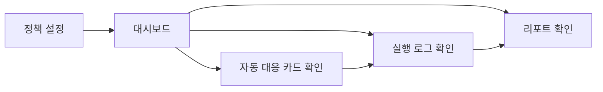

# Coin Agent Frontend 개발 명세

## 문서 목적

이 문서는 Next.js 기반 Frontend의 페이지, 컴포넌트, 화면 상태, UI/UX 원칙, 디자인 시스템 요약을 정의한다. 별도 `DESIGN.md`는 만들지 않으며, 디자인 시스템 관련 기준은 이 문서에 통합한다.

## 관련 문서

- 제품 요구사항: `SPEC.md`
- 구조 기준: `ARCHITECTURE.md`
- API 계약: `DATA.md`

## 1. FE 역할

FE는 사용자 입력과 결과 시각화에 집중한다. FE는 직접 시장 판단을 하지 않으며, 거래소를 직접 호출하지 않는다. 모든 데이터는 로컬 개인용 Agent 환경의 BE HTTP API를 통해 수신한다.

## 2. 페이지 목록

| 페이지 | 경로 예시 | 목적 |
|---|---|---|
| 정책 설정 | `/policy` | 감시 코인, 손절/익절, 주문 한도, 야간 정책 설정 |
| 대시보드 | `/dashboard` | 상태 카드, 자동 대응 카드, 최근 위험 상태 확인 |
| 실행 로그 | `/executions` | 페이퍼 실행 결과, 보류 사유, 시간순 로그 확인 |
| 리포트 | `/reports` | 일간 브리핑, 최근 요약 리포트 확인 |

## 3. 화면 흐름

## 4. 주요 컴포넌트

| 컴포넌트 | 목적 | 표시 내용 |
|---|---|---|
| `PolicyForm` | 정책 입력/수정 | 코인, 손절선, 익절선, 주문 한도, 자동 대응 규칙 |
| `StatusCard` | 현재 시장/위험 상태 요약 | 현재가, 변동률, 위험도, 감시 상태 |
| `ActionCard` | 자동 대응 후보 표시 | 후보 액션, 실행 가능 여부, 근거, 리스크 |
| `ExecutionLogTable` | 실행 이력 표시 | 시각, 코인, 액션, 결과, 보류 사유 |
| `DailyReportPanel` | 리포트 표시 | 요약, 핵심 이벤트, 리스크 해설 |
| `ErrorBanner` | 오류/주의 상태 표시 | API 오류, 데이터 부족, 실행 중지 안내 |

## 5. 화면별 사용자 흐름

### 5.1 정책 설정 화면

1. 사용자가 정책 입력 필드를 작성한다.
2. 저장 요청 시 유효성 검사를 수행한다.
3. 저장 성공 시 확인 메시지와 요약 정보를 보여준다.
4. 저장 실패 시 입력 오류와 수정 필요 항목을 보여준다.

### 5.2 대시보드 화면

1. 사용자가 접속하면 정책 요약과 감시 대상 상태를 조회한다.
2. 상태 카드에서 위험도와 현재 판단 상태를 확인한다.
3. 자동 대응 카드에서 실행 또는 보류 사유를 확인한다.

### 5.3 실행 로그 화면

1. 사용자가 최근 실행 결과를 시간순으로 확인한다.
2. 각 항목에서 리스크 게이트 통과 여부와 보류 사유를 확인한다.

### 5.4 리포트 화면

1. 사용자가 일간 리포트 목록 또는 최신 리포트를 확인한다.
2. 리포트는 요약, 근거, 리스크, 보류 이유 순으로 보여준다.

## 6. UI 상태 정의

| 상태 | 정의 | UI 처리 원칙 |
|---|---|---|
| 로딩 | API 응답 대기 중 | 스켈레톤 또는 로딩 메시지 표시 |
| 빈 상태 | 표시할 데이터가 없음 | 데이터 없음 이유와 다음 행동 안내 표시 |
| 성공 | 정상 데이터 수신 | 카드/표/리포트 표시 |
| 부분 오류 | 일부 데이터만 실패 | 마지막 정상 데이터 + 오류 배너 동시 표시 |
| 전체 오류 | 핵심 API 실패 | 전체 에러 상태와 재시도 안내 표시 |

## 7. 상태 카드 정의

상태 카드는 다음 필드를 포함한다.

- 코인명
- 현재가
- 24시간 변동률
- 손절선/익절선 대비 상태
- 위험도
- 자동 대응 대기 상태

색상은 위험도에 따라 중립/주의/경고 수준만 사용하며, 공격적 투자 유도 표현은 금지한다.

## 8. 자동 대응 카드 정의

자동 대응 카드는 다음 필드를 포함한다.

- 후보 액션
- 실행 가능 여부
- 근거 요약
- 리스크 요약
- 자동 실행 또는 보류 사유

자동 대응 카드는 “추천”보다 “정책 기반 후보”라는 톤을 우선한다.

## 9. 실행 로그 및 리포트 UI 정의

- 실행 로그는 시간순 표 형식으로 제공한다.
- 리포트는 카드형 또는 패널형 레이아웃으로 제공한다.
- 각 항목에는 설명, 리스크, 결과 상태가 반드시 함께 보여야 한다.
- 사용자가 “왜 실행되지 않았는가”를 빠르게 확인할 수 있어야 한다.

## 10. UI/UX 원칙

- 짧고 명확한 문장 사용
- 보수적이고 차분한 리스크 매니저 톤 유지
- 수익 보장, 확정적 예측 표현 금지
- 실행 결과보다 정책과 리스크 근거를 먼저 보여주기
- 색상은 경고/주의/중립 위주로 제한하기

## 11. 디자인 시스템 요약

### 11.1 타이포그래피

- 제목: 현재 화면 목적이 즉시 드러나야 한다.
- 본문: 짧은 설명 위주, 긴 문단 지양
- 수치: 가격/비율/상태를 구분해 일관된 포맷 사용

### 11.2 컬러 원칙

- 중립: 기본 상태
- 주의: 임계값 접근
- 경고: 정책 위반 또는 실행 차단
- 성공: 저장 완료, 정상 응답 등 제한적 사용

### 11.3 간격과 레이아웃

- 카드 중심 레이아웃
- 정책 입력 영역과 결과 확인 영역 분리
- 모바일 우선까지는 아니더라도 작은 화면 대응이 가능해야 함

### 11.4 접근성

- 상태 색상만으로 의미 전달 금지
- 아이콘 + 텍스트 병행
- 표와 카드에 명확한 제목 제공

## 12. FE에서 호출하는 API 요약

| API | 목적 |
|---|---|
| `GET /api/v1/policies/current` | 현재 사용자 정책 조회 |
| `POST /api/v1/policies` | 정책 저장 |
| `GET /api/v1/market/summary` | 대시보드 시장 요약 조회 |
| `POST /api/v1/actions/evaluate` | 정책 기반 자동 대응 후보 평가 |
| `GET /api/v1/executions` | 실행 로그 조회 |
| `GET /api/v1/reports/daily` | 일간 리포트 조회 |

세부 요청/응답 스키마는 `DATA.md`를 기준으로 한다.

## 13. 확정 구현 기준

- 초기 페이지는 4개로 제한한다.
- 인증 없는 단일 사용자 데모 UI로 시작한다.
- 실시간 스트리밍 대신 수동 새로고침으로 시작한다.
- 업비트 실시간 시세/캔들 데이터는 FE가 직접 받지 않고 BE를 통해서만 표시한다.
- 대시보드와 정책 화면은 분리한다.
- 리포트 화면은 별도 페이지로 둔다.
