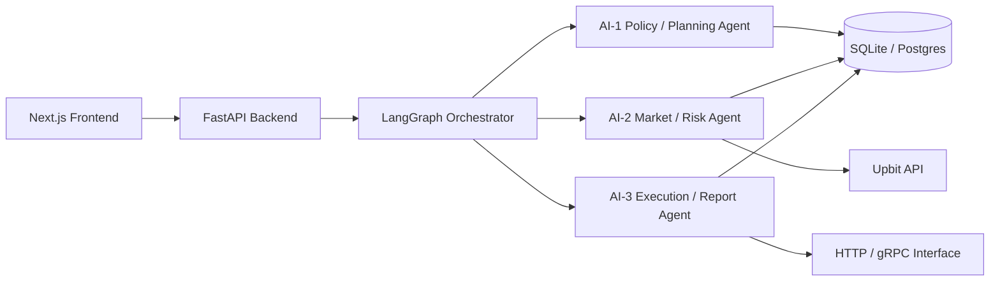
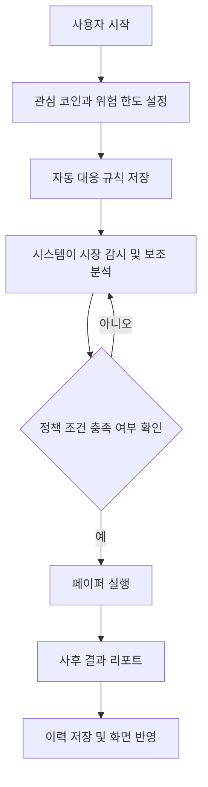
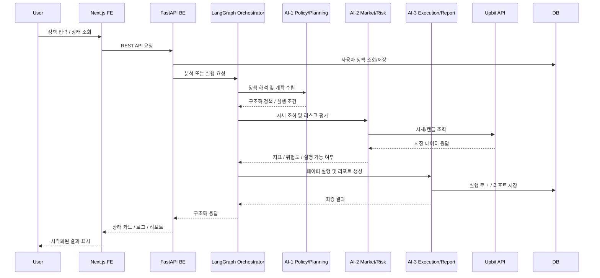
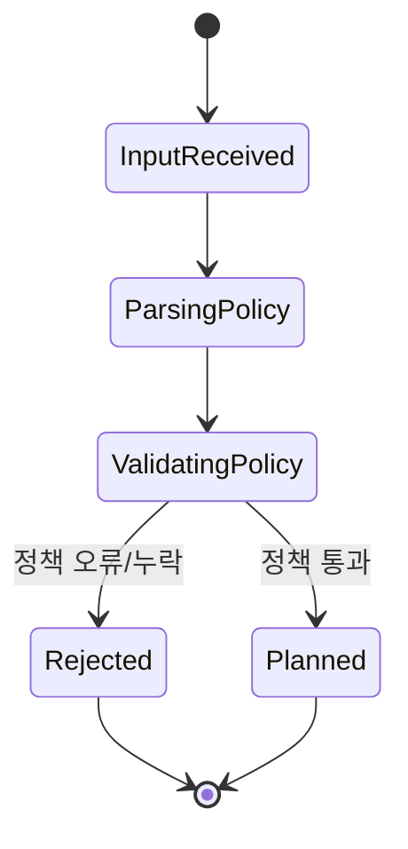
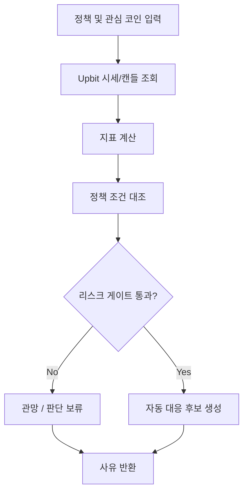
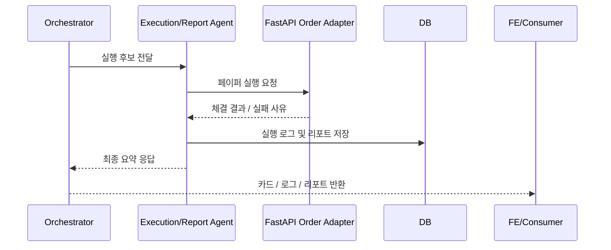
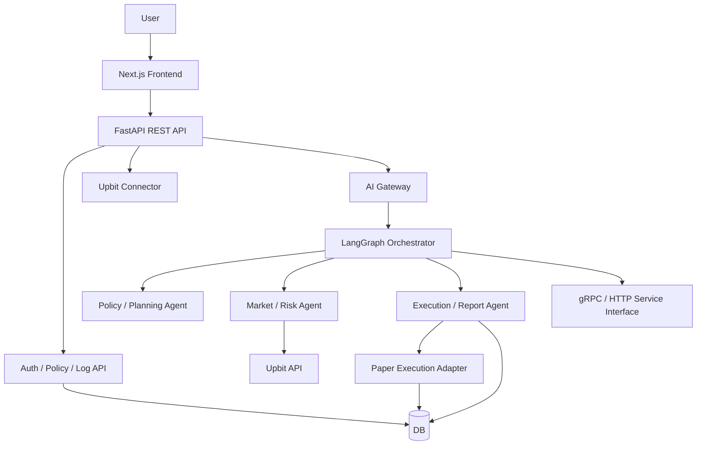
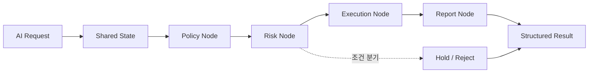
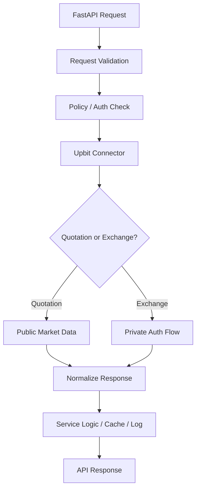

# Coin Agent 프로젝트 기획서

> 이 문서는 Coin Agent의 상위 기획 근거 문서다. 구현 상세는 `SPEC.md`, `ARCHITECTURE.md`, `FE.md`, `BE.md`, `AI.md`, `DATA.md`, `TEST_AND_DEMO.md`를 따른다.

## 목차

- [0. 기본 정보](#0-기본-정보)
- [1. 문제 정의 및 프로젝트 개요](#1-문제-정의-및-프로젝트-개요)
- [2. 사용자 및 통합 Agent 설계](#2-사용자-및-통합-agent-설계)
- [3. 핵심 기능 및 사용자 흐름](#3-핵심-기능-및-사용자-흐름)
- [4. 기술 구현 설계](#4-기술-구현-설계)
- [5. 성과 평가 및 실행 계획](#5-성과-평가-및-실행-계획)
- [6. 최종 점검 체크리스트](#6-최종-점검-체크리스트)

---

## 0. 기본 정보

| 항목 | 내용 |
|---|---|
| 프로젝트명 | Coin Agent |
| 팀명 | 53조 |
| 참여자 | 박철민, 백승우, 백준현, 신진범, 장보형 |
| 작성일 | 2026-05-04 |
| 버전 | v1.1 |

---

## 1. 문제 정의 및 프로젝트 개요

### 1.1 프로젝트 한 줄 정의

```text
우리는 24시간 움직이는 가상자산 시장을 계속 지켜보기 어려운 비전업 투자자를 위해, 사용자가 미리 정한 투자 정책과 위험 한도 안에서 시장 감시, 정책 기반 자동 대응, 설명 가능한 결과 보고를 수행하는 보수적 코인 투자 보조 시스템을 개발한다.
```

---

### 1.2 서비스 한 줄 정의

```text
Coin Agent는 사용자의 관심 코인, 손절·익절 기준, 주문 한도, 자동 대응 규칙을 바탕으로 시장을 계속 모니터링하고, 사전 정의된 정책 안에서만 페이퍼 실행을 수행하며, 차트·지표 분석 정보와 실행 이유를 함께 제공하는 투자 보조 서비스이다.
```

---

### 1.3 서비스 선정 배경

```text
가상자산 시장은 24시간 움직이지만 대부분의 개인 투자자는 일, 수면, 이동, 학업 때문에 시장을 상시 확인할 수 없다. 그 결과 중요한 변동을 뒤늦게 확인하거나, 급등락 상황에서 감정적으로 대응하는 일이 반복된다.

기존의 단순 예약 주문은 특정 가격 조건만 기준으로 동작해 시장 맥락을 설명하지 못하고, 완전 자동매매는 일반 사용자 입장에서 통제력과 책임에 대한 불안을 키운다. 따라서 사용자가 미리 정의한 정책 범위 안에서만 작동하고, 위험 신호와 실행 이유를 함께 설명하는 보수적 자동화가 필요하다.

이 프로젝트는 시장 감시, 조건 점검, 위험 경고, 설명 가능한 자동 대응 흐름을 하나의 통합 Agent 시스템 안에 묶는 것을 목표로 한다. 사용자는 투자 원칙과 위험 한도를 사전에 설정하고, 시스템은 그 정책 범위 안에서만 판단과 실행을 수행한다. 데모 단계에서는 실제 자금 이동보다 정책 기반 자동 판단 흐름, 리스크 게이트, 설명 가능한 결과 보고를 우선 구현해 안전성과 완성도를 확보한다.
```

---

### 1.4 해결하려는 문제

| 구분 | 작성 내용 |
|---|---|
| 현재 상황 | 가상자산 시장은 24시간 운영되고 변동성이 크지만, 개인 투자자는 업무와 수면 때문에 상시 대응이 어렵다. |
| 사용자가 겪는 문제 | 중요한 매수·매도 시점을 놓치거나 뒤늦게 충동적으로 대응하고, 미리 정한 손절·익절 기준도 실제 상황에서는 지키기 어렵다. |
| 문제가 발생하는 이유 | 시장은 계속 움직이지만 사용자의 시간과 집중력은 제한돼 있고, 단순 가격 조건만으로는 시장 맥락과 위험도를 반영하기 어렵다. |
| 해결이 필요한 이유 | 사용자가 시장을 24시간 보지 않아도 사전에 정한 정책과 위험 제한을 일관되게 적용하고, 각 판단의 이유를 이해할 수 있어야 감정 개입을 줄이고 더 안정적인 의사결정을 할 수 있다. |

---

### 1.5 대상 사용자

| 항목 | 작성 내용 |
|---|---|
| 주요 사용자 | 전업 트레이더가 아닌 개인 가상자산 투자자. 특히 직장인, 대학생, 프리랜서처럼 시장을 상시 모니터링하기 어려운 사용자 |
| 사용자가 처한 상황 | 관심 코인과 본인만의 대략적인 투자 기준은 있지만, 일하는 시간과 자는 시간에는 시장 대응이 어렵다. |
| 사용자의 목표 | 시장 감시 부담을 줄이면서도 자신이 정한 투자 원칙과 위험 한도를 지키고, 필요한 순간에만 근거 있는 자동 대응 결과를 확인하는 것 |
| 사용자의 어려움 | 24시간 시장 피로감, 급락 대응 실패 경험, 충동 매매, 자동매매에 대한 불안, 무엇을 해야 할지 빠르게 판단하기 어려움 |

---

### 1.6 핵심 가치

```text
Coin Agent의 핵심 가치는 “자동 대응을 맡기되, 블랙박스로 만들지 않는 것”이다.
이 서비스는 사용자가 계속 차트를 보지 않아도 되도록 감시와 분석을 대신 수행하면서도,
차트·지표 해석 정보는 보조적으로 제공하고, 모든 판단에 대해 현재 상태, 감지된 조건, 행동 근거, 리스크, 실행 여부를 자연어로 설명한다.

즉, 안전한 자동화와 설명 가능성을 함께 제공하는 것이 이 프로젝트의 핵심 가치다.
```

---

## 2. 사용자 및 통합 Agent 설계

### 2.1 타깃 사용자 페르소나

| 항목 | 작성 내용 |
|---|---|
| 이름/유형 | 김현우 / 비전업 개인 가상자산 투자자 |
| 연령대 | 20대 후반 ~ 30대 후반 |
| 직업/역할 | 사무직 직장인 |
| 사용 환경 | 평일에는 짧게만 확인 가능하고, 자기 전이나 점심시간에만 투자 결정을 내린다. 데모에서는 웹 화면에서 정책 설정, 상태 확인, 결과 리포트를 본다. |
| 주요 니즈 | 자는 동안과 일하는 동안 시장을 대신 봐주는 감시 기능, 손실 제한, 보수적인 자동 대응, 실행 이유 설명 |
| 주요 불편함 | 차트를 계속 보기 어렵고, 알림이 와도 실제로 무엇이 일어났는지 빠르게 파악하기 어렵다. 완전 자동매매는 통제력을 잃을까 불안하다. |

---

### 2.2 통합 Agent 시스템 개념

| 구분 | 작성 내용 |
|---|---|
| 시스템 구조 | 여러 Agent를 분산 배치하지 않고, 하나의 LangGraph 기반 통합 오케스트레이터 안에 3개의 AI 역할 Agent를 포함하는 구조 |
| 통합 목적 | 역할은 분리하되 사용자 입장에서는 하나의 일관된 Coin Agent처럼 보이게 하여 복잡도를 줄이고 유지보수성과 설명 가능성을 높임 |
| 사용자에게 보이는 형태 | 정책 설정, 실시간 상태, 자동 대응 결과, 실행 로그, 리포트를 제공하는 하나의 서비스 |
| 내부 역할 분해 | Policy/Planning Agent, Market/Risk Agent, Execution/Report Agent |
| 핵심 원칙 | 정책 우선, 리스크 게이트 우선, 무거래 또는 판단 보류 기본값, 실제 자금 이동 없는 페이퍼 실행 |

---

### 2.3 통합 Agent의 역할

| 구분 | 작성 내용 |
|---|---|
| Agent가 수행하는 일 | 사용자 투자 정책을 구조화하고, 시세와 지표를 조회하며, 위험 한도와 조건 충족 여부를 판단하고, 자동 대응 후보를 생성한 뒤 결과를 설명한다. 정책을 통과한 경우에만 페이퍼 실행을 수행한다. |
| Agent가 도와주는 범위 | 시장 모니터링, 조건 감지, 보조 차트·기술지표 분석, 위험 경고, 설명 가능한 자동 대응, 실행 로그와 요약 리포트 제공 |
| Agent가 하지 않는 일 | 수익 보장, 무제한 자동매매, 레버리지·선물·마진 거래, 출금 자동화, 세무·법률 자문, 사용자 동의 없는 고위험 주문 |
| 최종 산출물 | 시그널 요약 카드, 위험 상태 요약, 자동 대응 결과, 페이퍼 실행 결과, 자연어 일간 리포트 |

---

### 2.4 Agent의 성격 및 톤앤매너

| 항목 | 작성 내용 |
|---|---|
| 말투 | 차분하고 보수적인 리스크 매니저 겸 투자 비서 톤 |
| 응답 길이 | 알림과 상태 카드는 짧고 명확하게, 리포트는 요약·근거·리스크·선택지 순으로 구조화 |
| 설명 방식 | 현재 상태, 감지된 조건, 가능한 행동, 리스크, 자동 실행 여부와 보류 사유를 분리해 설명 |
| 피해야 할 표현 | 수익 보장, 확정적 급등 예측, 과도한 낙관 표현, 조급함을 유도하는 문구, 밈성 투자 표현 |

---

### 2.5 Agent의 자율성 범위

| 단계 | Agent 수행 가능 여부 | 설명 |
|---|---:|---|
| 사용자 입력 해석 | 가능 | 관심 코인, 손절·익절 기준, 주문 한도, 손실 한도, 자동 대응 규칙을 정책 객체로 변환 |
| 정보 검색/조회 | 가능 | Upbit 시세 및 캔들 데이터, 로컬 설정값, 이벤트 로그 조회 |
| 데이터 분석 | 가능 | RSI, 이동평균, 손익률, 변동성, 정책 위반 여부 계산 |
| 결과 요약 | 가능 | 상태 카드, 자동 대응 카드, 리포트 형태로 핵심 정보 요약 |
| 추천/판단 | 제한적 가능 | 자동 대응 후보를 생성하되 반드시 정책과 리스크 게이트를 통과해야 함 |
| 외부 작업 실행 | 제한적 가능 | 사전 정의된 낮은 위험 자동 대응 규칙 안에서만 페이퍼 실행을 수행 |
| 최종 결정 | 기본적으로 사전 설정된 정책 | MVP 기준 투자 책임은 사용자에게 있으며, Agent는 정책 범위를 넘는 실행을 하지 않음 |

**자율성 범위 요약**

```text
Coin Agent는 해석, 조회, 분석, 요약, 제한형 자동 판단까지는 자율적으로 수행한다.
다만 실제 데모 범위에서는 정책 기반 제한형 자동 실행을 중심으로 설계하며,
실제 자금이 이동하는 완전 자동주문은 포함하지 않는다.
```

---

### 2.6 FE1 / BE1 / AI3 팀 구성

| 역할 | 인원 | 핵심 책임 | 주요 산출물 |
|---|---:|---|---|
| FE | 1 | Next.js 기반 사용자 화면, 대시보드, 정책 입력 UX, 상태 카드 및 로그/리포트 UI 구현 | 정책 입력 화면, 실시간 상태 화면, 실행 이력 화면 |
| BE | 1 | FastAPI 기반 REST API, 인증/설정/로그/실행 API, Upbit 연동 어댑터, 데이터 저장소 설계 | API 서버, Upbit 커넥터, DB 스키마, 실행 로그 관리 |
| AI-1 | 1 | Policy/Planning Agent 설계, 사용자 정책 해석, 정책 스키마 검증, 실행 계획 작성 | 정책 파서, 플래닝 노드, 정책 검증 로직 |
| AI-2 | 1 | Market/Risk Agent 설계, 지표 계산, 리스크 룰 엔진, 조건 감지 로직 | 데이터 분석 노드, 리스크 게이트, 조건 판별 로직 |
| AI-3 | 1 | Execution/Report Agent 설계, 페이퍼 실행, 결과 설명, 리포트 생성, 인터페이스 확장 | 실행 노드, 리포트 노드, gRPC/HTTP AI 인터페이스 |

---

### 2.7 통합 Agent 내부 구성도



**설계 설명**

1. 사용자는 Next.js 화면에서 정책을 설정하고 현재 상태를 조회한다.
2. FastAPI는 사용자 요청을 수신하고 도메인 API, 저장소, Upbit 연동을 담당한다.
3. LangGraph Orchestrator는 단일 진입점으로 동작하며 내부에서 세 AI Agent를 순서대로 또는 조건부로 호출한다.
4. 각 AI Agent는 역할이 다르지만 사용자에게는 하나의 Coin Agent로 보인다.
5. 결과는 REST API를 통해 FE로 전달되고, 내부 서비스 간 연동에는 gRPC 또는 HTTP 인터페이스를 사용할 수 있다.

---

## 3. 핵심 기능 및 사용자 흐름

### 3.1 주요 사용자 시나리오

| 시나리오 | 사용자 상황 | 사용자 입력 | Agent 응답/동작 | 기대 결과 |
|---|---|---|---|---|
| 시나리오 1 | 사용자가 출근 전 포트폴리오 위험 상태를 빠르게 확인하고 싶다. | 사전 설정된 포트폴리오와 위험 한도 | Agent가 현재가, 24시간 변동률, 손절 기준 충족 여부, 경고 수준, 자동 대응 대기 상태를 요약해 보여준다. | 사용자는 1분 안에 오늘 자동 감시 대상 자산과 위험도를 파악한다. |
| 시나리오 2 | 사용자가 업무 중이라 시장을 볼 수 없는데 BTC가 급락한다. | 사전 설정: “BTC가 5% 이상 하락하거나 손실 한도에 가까워지면 비중 축소 페이퍼 실행.” | Agent가 조건 충족을 감지하고, 보조 차트·지표 해석과 함께 비중 축소 또는 손절 페이퍼 실행을 자동 수행한 뒤 결과를 기록한다. | 사용자는 시장을 계속 보지 않아도 중요한 위험 신호와 자동 대응 결과를 함께 확인한다. |
| 시나리오 3 | 사용자가 취침 전에 야간 자동 대응 정책을 설정한다. | “오늘 밤 1회 주문 5만 원 이하, 손실 한도 3%, 신규 매수는 BTC만.” | Agent가 제한 규칙을 저장하고, 밤 동안 조건을 감시하며, 정책 범위 안에서 페이퍼 실행을 수행한 뒤 결과를 아침 브리핑으로 제공한다. | 사용자는 실제 자금 이동 없이도 통제 가능한 자동 대응 흐름을 확인할 수 있다. |

---

### 3.2 핵심 기능 정의

| 우선순위 | 기능명 | 기능 설명 | 입력 | 출력 | 필수 여부 |
|---:|---|---|---|---|---|
| 1 | 투자 정책 온보딩 | 관심 코인, 손절·익절 기준, 1회 주문 한도, 손실 한도, 자동 대응 규칙을 설정 | 폼 입력, 템플릿형 자연어 입력 | 구조화된 사용자 정책 JSON | 필수 |
| 2 | 시장 감시 및 보조 지표 분석 | 시세와 캔들 데이터를 주기적으로 조회하고 RSI, 이동평균, 변동률 등을 계산하며 차트 해석 정보를 보조적으로 제공 | Upbit 시세·캔들 데이터 | 현재 상태 요약, 지표 계산 결과, 보조 차트 해석 | 필수 |
| 3 | 리스크 룰 엔진 | 정책 위반 여부, 손실 한도 접근, 급락, 추격매수 위험 등을 판단 | 시장 데이터, 사용자 정책 | 위험도, 감지 조건, 차단 여부 | 필수 |
| 4 | 자동 대응 카드 | 매수·매도·관망 후보와 이유, 반대 근거, 예상 리스크를 카드 형식으로 생성 | 분석 결과, 리스크 판단 결과 | 자동 대응 후보, 실행/보류 사유 | 필수 |
| 5 | 페이퍼 실행 | 실제 자금 이동 없이 모의 체결 결과를 생성 | 자동 대응 정책을 통과한 주문 후보 | 페이퍼 체결 로그 | 필수 |
| 6 | 자연어 리포트 | 이벤트, 자동 대응 실행 결과를 사람이 이해하기 쉬운 형태로 요약 | 이벤트 로그, 거래 로그 | 일간 브리핑, 최근 이력 요약 | 권장 |

---

### 3.3 사용자 관점 워크플로우



---

### 3.4 시스템 관점 통합 워크플로우



**단계별 설명**

1. FE는 사용자 입력을 수집하고 REST API로 BE에 전달한다.
2. BE는 정책 저장, 요청 검증, 사용자 상태 조회를 담당한다.
3. LangGraph는 요청 종류에 따라 정책 해석 → 시장 분석 → 실행/리포트 순으로 내부 Agent를 조합한다.
4. Upbit 조회와 리스크 판별 결과가 정책을 통과한 경우에만 페이퍼 실행이 진행된다.
5. 최종 결과는 DB에 기록되고, FE는 이를 카드·로그·리포트 형태로 사용자에게 보여준다.

---

### 3.5 AI-1 Policy / Planning Agent 상세 설계

#### 역할 요약

- 사용자의 정책 입력을 구조화된 정책 객체로 변환한다.
- 입력 누락, 과도한 자동화 요청, 비현실적 조건을 사전 차단한다.
- 이후 Agent들이 사용할 실행 계획과 제약 조건을 생성한다.

#### 상태 다이어그램



#### 단계별 로직 설명

1. 사용자의 폼 입력 또는 템플릿형 자연어를 수신한다.
2. 코인, 손절선, 익절선, 주문 한도, 손실 한도, 자동 대응 규칙을 구조화한다.
3. 필수값 누락, 허용 범위 초과, 지원하지 않는 코인 여부를 검증한다.
4. 검증 실패 시 무거래 및 경고 메시지로 종료한다.
5. 검증 성공 시 이후 분석 단계에서 사용할 정책 JSON과 실행 조건을 반환한다.

---

### 3.6 AI-2 Market / Risk Agent 상세 설계

#### 역할 요약

- Upbit 시세 및 캔들 데이터를 조회한다.
- RSI, 이동평균, 변동률, 손익률, 손실 한도 접근 여부를 계산한다.
- 정책 위반 여부와 자동 대응 가능 여부를 리스크 게이트로 판정한다.

#### 흐름도



#### 단계별 로직 설명

1. Policy Agent가 넘긴 정책과 감시 대상 코인을 입력으로 받는다.
2. Upbit Quotation API에서 현재가와 캔들 데이터를 조회한다.
3. 기본 지표를 계산하고 단순 가격 조건을 시장 맥락과 함께 해석한다.
4. 손실 한도, 허용 코인, 허용 주문 크기, 급락 위험, 추격매수 위험을 점검한다.
5. 리스크 게이트를 통과하지 못하면 관망 또는 판단 보류를 반환한다.
6. 통과하면 매수·매도·비중 축소 같은 자동 대응 후보를 생성한다.

---

### 3.7 AI-3 Execution / Report Agent 상세 설계

#### 역할 요약

- 통과된 자동 대응 후보를 페이퍼 실행으로 처리한다.
- 실행 결과와 보류 사유를 자연어 리포트로 요약한다.
- HTTP/gRPC 인터페이스를 통해 다른 서비스가 재사용할 수 있도록 한다.

#### 시퀀스 다이어그램



#### 단계별 로직 설명

1. Orchestrator가 전달한 실행 후보를 수신한다.
2. FastAPI의 주문 어댑터를 호출해 실제 주문이 아닌 페이퍼 실행을 수행한다.
3. 실행 결과, 실패 사유, 리스크 요약, 정책 근거를 구조화된 결과로 정리한다.
4. 결과를 로그와 리포트 형태로 DB에 저장한다.
5. 외부 소비자를 위해 HTTP 또는 gRPC 인터페이스로 결과를 노출할 수 있게 한다.

---

## 4. 기술 구현 설계

### 4.1 기술 스택

| 영역 | 사용 기술 | 선택 이유 |
|---|---|---|
| Frontend / UI | Next.js 15 기준 웹 애플리케이션 | 정책 설정, 상태 확인, 실행 이력, 리포트 조회를 구조적으로 나누기 쉽고 대시보드 UI 구현에 적합하다. |
| Backend API | FastAPI | REST API, Upbit 커넥트, 인증/설정/로그 API, 비동기 처리 구성이 명확하다. |
| AI Orchestration | LangGraph | 정책 해석, 분석, 리스크 검증, 실행, 리포트 흐름을 상태 기반 그래프로 명확하게 구성할 수 있다. |
| AI Interface | HTTP + gRPC | 브라우저/외부 서비스에는 HTTP를, 내부 AI 서비스 간 고성능 연동과 확장에는 gRPC를 사용한다. |
| LLM / Model | OpenAI GPT-4o 계열 1종 | 정책 해석, 분석 설명, 자연어 리포트 생성에 활용하고, 최종 위험 판단은 룰 엔진이 담당한다. |
| Database / Storage | SQLite 또는 PostgreSQL | MVP에서는 SQLite로 빠르게 시작하고, 확장 시 PostgreSQL로 전환 가능하도록 설계한다. |
| 기타 도구 | pyupbit 또는 Upbit REST 직접 연동, pandas, plotly | Upbit 시세 조회, 기본 지표 계산, 결과 시각화와 데이터 가공에 적합하다. |

---

### 4.2 전체 시스템 아키텍처



**설계 요점**

1. FE는 사용자 경험과 시각화에 집중하고, 비즈니스 로직은 직접 갖지 않는다.
2. BE는 시스템의 도메인 중심 계층으로서 정책, 로그, Upbit 연동, 실행 API를 담당한다.
3. AI 계층은 별도의 통합 오케스트레이터로 묶어 두고, 역할별 Agent를 내부 모듈로 운영한다.
4. AI 서비스는 FastAPI와 HTTP/gRPC 양쪽 인터페이스로 연결 가능하게 설계해 이후 서비스 확장을 쉽게 한다.
5. 외부 거래소 직접 호출, 실행 로그, 리포트 저장은 모두 서버 측에서만 처리한다.

---

### 4.3 FE / BE / AI 모듈 경계

| 계층 | 책임 | 포함 기능 | 제외 기능 |
|---|---|---|---|
| FE (Next.js) | 사용자 입력과 결과 시각화 | 정책 입력 폼, 상태 카드, 실행 이력, 리포트 화면, API 호출 | 거래소 직접 호출, 정책 판단, 주문 실행 |
| BE (FastAPI) | 시스템 API와 도메인 처리 | REST API, 정책 저장, 로그 저장, Upbit 커넥터, 페이퍼 실행 어댑터 | 대규모 UI 렌더링, 프롬프트 직접 생성 |
| AI (LangGraph) | 정책 해석, 분석, 리스크 판단, 실행 요약 | Agent orchestration, 지표 해석, 리스크 게이트, 리포트 생성, HTTP/gRPC 인터페이스 | 브라우저 렌더링, 거래소 인증 정보 직접 관리 UI |

---

### 4.4 LangGraph 모듈형 아키텍처 설계



**모듈 설계 원칙**

1. 하나의 큰 Agent를 무한히 확장하는 대신, 공통 상태를 공유하는 여러 노드로 분해한다.
2. 노드는 `정책 해석`, `리스크 판단`, `실행`, `리포트`처럼 책임이 명확해야 한다.
3. 새로운 Agent가 필요하면 기존 그래프 바깥에 또 다른 시스템을 만드는 것이 아니라, LangGraph 내부에 새 노드 또는 서브그래프 형태로 추가한다.
4. 공통 상태에는 정책, 시장 데이터, 리스크 결과, 실행 후보, 리포트 초안, 오류 상태를 포함한다.
5. 실패 시 기본값은 항상 무거래 또는 판단 보류이며, 상태 전이를 통해 사유를 추적 가능해야 한다.

---

### 4.5 AI 서비스 인터페이스 전략

| 인터페이스 | 사용 대상 | 용도 | 비고 |
|---|---|---|---|
| REST / HTTP | Next.js, 관리자 화면, 외부 연동 | 정책 해석 요청, 상태 조회, 리포트 조회, 실행 요청 | 브라우저 친화적, 디버깅 용이 |
| gRPC | FastAPI 내부 서비스 연동, 향후 멀티 서비스 확장 | 스트리밍 응답, 고성능 내부 통신, 강한 계약 기반 API | 향후 AI 기능 확장과 모듈 분리에 유리 |

**인터페이스 설계 설명**

1. 사용자 요청과 화면 표시 중심 기능은 REST API로 충분하다.
2. AI 응답 스트리밍, 서비스 간 고성능 통신, 다중 AI 모듈 확장에는 gRPC가 유리하다.
3. 따라서 MVP는 REST 중심으로 시작하되, AI 계층은 gRPC 추가가 가능한 구조로 설계한다.

---

### 4.6 FastAPI + Upbit 커넥트 설계



**단계별 설명**

1. FastAPI는 FE 또는 AI 계층에서 들어온 요청을 검증한다.
2. 요청 종류에 따라 공개 시세 조회와 인증이 필요한 실행 경로를 분기한다.
3. Upbit 응답은 내부 표준 스키마로 정규화한다.
4. 네트워크 오류, 요청 제한, 인증 실패는 모두 공통 예외 포맷으로 반환한다.
5. 페이퍼 실행에서도 동일한 주문 스키마를 사용해 나중에 실거래 연동 가능성을 열어 둔다.

---

### 4.7 프롬프트 설계 전략

| 항목 | 설계 내용 |
|---|---|
| System Prompt 역할 | Agent를 공격적 트레이더가 아니라 보수적 리스크 관리자이자 투자 보조자로 정의한다. 항상 사용자 정책과 위험 한도를 우선하게 한다. |
| 사용자 입력 형식 | 폼 입력을 기본으로 하고, 템플릿형 자연어 정책 입력을 보조적으로 허용한다. 예: “BTC가 5% 하락하면 비중 축소”, “1회 주문 5만 원 이하”. |
| Agent 출력 형식 | `현재 상태`, `감지된 조건`, `추천 행동`, `근거`, `리스크`, `실행 가능 여부`, `자동 실행/보류 사유`를 포함한 구조화 출력 사용 |
| 금지해야 할 응답 | 수익 보장, 확정적 급등 예측, 사용자 정책 무시, 레버리지 권유, 승인 없는 실제 주문 유도 |
| 검증 방식 | LLM 출력은 구조화 스키마와 리스크 룰 엔진을 함께 통과해야 하며, 검증 실패 시 기본값은 무거래 또는 판단 보류로 처리한다. |

---

### 4.8 데이터 활용 및 기억 관리

| 항목 | 작성 내용 |
|---|---|
| 입력 데이터 | 사용자 정책, 관심 코인 목록, Upbit 시세 및 캔들 데이터 |
| 저장 데이터 | 사용자 정책, 이벤트 로그, 자동 대응 이력, 페이퍼 실행 기록, 일간 리포트 |
| 임시 데이터 | 실시간 시세 응답, 계산 중 지표, 자동 대응 후보, 현재 세션 상태 |
| 사용자별 기억 필요 여부 | 필요. 단일 사용자 데모 기준으로 자동 대응 규칙, 손실 한도, 관심 코인, 알림 조건 같은 최소 정보만 유지한다. |
| 데이터 보관/삭제 기준 | API 키는 환경변수 또는 서버 보안 저장소로 관리하고, 정책과 로그는 DB에 저장한다. 데모 종료 시 삭제 가능해야 한다. |

---

### 4.9 제약사항 및 예외 처리

| 구분 | 내용 | 대응 방식 |
|---|---|---|
| 기술적 제약 | 거래소 API 요청 제한, 네트워크 장애, 주기 작업 실패 가능성 | 재시도와 간단한 백오프를 적용하고, 실패 시 마지막 정상 상태를 보여주며 신규 실행은 보류한다. |
| 데이터 제약 | MVP에서는 시세와 기본 지표 중심이라 뉴스, 온체인, 거시 변수까지 모두 반영하지 못한다. | 데이터가 부족하면 과감한 추천 대신 관망 또는 판단 보류를 반환한다. |
| 기능 범위 제외 | 실거래 자동주문, 레버리지·선물·마진, 다중 거래소 차익거래, 세금 계산, 모바일 앱 | 범위 제외 항목을 명시하고 현물·저빈도·정책 기반 데모에 집중한다. |
| 잘못된 입력 | 비현실적 주문 금액, 손실 한도 미입력, 지원하지 않는 코인, 과도한 자동화 요청 | 필수 조건이 없으면 실행을 막고, 안전한 기본값 설정을 요구한다. |
| Agent 응답 실패 | 스키마 이탈, 설명 실패, 과도한 추천 생성 가능성 | 구조화 출력 검증과 룰 엔진 이중 검사를 거치고, 실패 시 무거래 및 경고 메시지를 반환한다. |
| 외부 API/도구 실패 | Upbit 장애, 인증 오류, 페이퍼 실행 실패 | 오류 원인을 사용자에게 알리고 자동 대응을 일시 정지한 뒤 경고와 재확인 대기 상태를 남긴다. |
| 구조적 복잡도 증가 | Agent가 늘어나며 흐름이 복잡해질 수 있음 | 개별 마이크로서비스를 남발하지 않고 단일 Orchestrator + 모듈형 노드 구조를 유지한다. |

---

## 5. 성과 평가 및 실행 계획

### 5.1 성공 지표 KPI

| 지표 | 목표 기준 | 측정 방법 |
|---|---|---|
| 기능 완성도 | 핵심 시나리오 3개 모두 end-to-end 동작 | 시나리오별 체크리스트 테스트 |
| 정책 준수율 | 사용자 정책 위반 자동 대응 및 실행 0건 | 테스트 로그 검토 |
| 출력 안정성 | 주요 시나리오에서 구조화 출력과 리포트 형식이 안정적으로 유지 | 리허설 결과와 로그 확인 |
| 사용자 편의성 | 사용자가 1분 이내에 현재 위험 상태와 필요한 결정을 이해 | 데모 리허설 관찰 및 피드백 |
| 데모 가능 여부 | 로컬 또는 팀 데모 환경에서 시세 조회, 조건 감지, 자동 대응 카드, 페이퍼 실행, 리포트가 한 흐름으로 동작 | 발표 전 리허설 성공 여부 |

---

### 5.2 MVP 범위

#### 반드시 구현할 것

- Next.js 기반 정책 입력 화면, 상태 확인 화면, 로그/리포트 화면
- FastAPI 기반 사용자 정책 API, 실행 로그 API, Upbit 시세 조회 API
- LangGraph 기반 Policy / Risk / Execution 통합 Agent 흐름
- Upbit 기반 시세·캔들 조회와 RSI·이동평균 등 기본 지표 계산
- 정책 기반 리스크 룰 엔진과 설명 가능한 자동 대응 카드 생성
- 사전 정의된 자동 대응 규칙 안에서만 페이퍼 실행 수행
- 이벤트 로그와 자연어 요약 리포트, 최근 판단·실행 이력 조회

#### 이번 범위에서 제외할 것

- 실제 자금이 이동하는 완전 자동주문
- 레버리지, 선물, 마진, 공매도 등 고위험 상품
- 다중 거래소 동시 운용, 차익거래, 정식 모바일 앱, 고도화된 백테스트 추천 시스템

#### MVP 완료 기준

```text
사용자가 웹 환경에서 관심 코인과 위험 한도, 자동 대응 규칙을 설정하면,
FastAPI와 LangGraph 기반 Coin Agent 시스템이 Upbit 시세를 조회해 현재 상태와 자동 대응 카드를 생성하고,
정책과 리스크 게이트를 통과한 경우에만 페이퍼 실행을 수행한 뒤,
결과와 보류 사유를 정해진 형식으로 반환하면 MVP가 완료된 것으로 본다.
```

---

### 5.3 단계별 개발 로드맵

| 단계 | 목표 | 주요 작업 | 완료 기준 |
|---:|---|---|---|
| 1단계 | 아키텍처 뼈대 구축 | Next.js 기본 화면, FastAPI 기본 API, LangGraph Orchestrator, 정책 스키마, Upbit 조회 연결 | 정책 입력 → 시세 조회 → 상태 카드 표시까지 연결 |
| 2단계 | 핵심 자동 대응 구현 | 리스크 룰 엔진, 자동 대응 카드, 페이퍼 실행, 실행 로그 저장 | 핵심 시나리오 1개 이상을 end-to-end 시연 가능 |
| 3단계 | 설명 가능성과 안정성 보강 | 자연어 리포트, 예외 처리, 리스크 경고, HTTP/gRPC 인터페이스 정리 | 자동 시나리오 3개를 안정적으로 시연 가능 |
| 4단계 | 최종 발표 준비 | UI 정리, 데모 스크립트, 장표 작성, 로그/리포트 검수 | 발표 자료와 데모 흐름 준비 완료 |

---

### 5.4 역할별 실행 계획

| 역할 | 주차별 우선 작업 |
|---|---|
| FE1 | 정책 입력 폼 → 대시보드 카드 → 실행 이력 / 리포트 UI |
| BE1 | FastAPI 라우터 → 정책/로그 API → Upbit 어댑터 → 페이퍼 실행 API |
| AI-1 | 정책 파서 → 정책 검증 → 실행 계획 노드 |
| AI-2 | 시세 수집 → 지표 계산 → 리스크 게이트 |
| AI-3 | 페이퍼 실행 노드 → 리포트 노드 → HTTP/gRPC 인터페이스 |

---

### 5.5 기대 효과

```text
사용자 관점에서는 시장 감시 시간이 줄고, 중요한 순간에 정책 기반 자동 대응과 그 근거를 함께 확인하는 투자 경험을 만들 수 있다.
또한 자동화에 대한 불안을 줄이기 위해 정책 기반 통제, 제한형 자동 실행, 보조 차트 분석 정보, 명확한 로그와 자연어 설명을 함께 제공한다.

팀 관점에서는 Next.js, FastAPI, LangGraph를 분리된 계층으로 설계하면서도 하나의 통합 Agent 시스템으로 묶어 Agentic Workflow의 핵심인 입력 해석, 도구 호출, 상태 저장, 리스크 게이트, 제한형 자동 실행, 예외 처리를 현실적으로 보여줄 수 있다.
특히 금융성 서비스를 다룰 때 필요한 안전성, 설명 가능성, 범위 통제를 데모 수준에서 현실적으로 반영한 사례가 된다.
```

---

## 6. 최종 점검 체크리스트

| 체크 항목 | 확인 |
|---|---:|
| 프로젝트 한 줄 정의가 명확한가? | ☑ |
| 대상 사용자가 구체적인가? | ☑ |
| 해결하려는 문제가 기능보다 먼저 설명되어 있는가? | ☑ |
| 통합 Agent 구조와 역할 분리가 명확한가? | ☑ |
| FE1 / BE1 / AI3 팀 구성이 문서에 반영되어 있는가? | ☑ |
| 각 AI Agent별 로직과 Mermaid 다이어그램이 포함되어 있는가? | ☑ |
| Frontend가 Next.js 기반으로 정의되어 있는가? | ☑ |
| Backend가 FastAPI + Upbit 커넥트 기반으로 정의되어 있는가? | ☑ |
| AI가 LangGraph 기반 모듈형 아키텍처와 HTTP/gRPC 인터페이스를 포함하는가? | ☑ |
| 제약사항과 예외 처리가 포함되어 있는가? | ☑ |
| 데모 기준이 명확한가? | ☑ |

---

## 결정 필요 사항

- **MVP 기준 제안**으로 DB를 SQLite로 시작한 뒤 PostgreSQL로 확장할지 확정이 필요하다.
- **MVP 기준 제안**으로 AI 서비스 인터페이스를 HTTP 우선으로만 열지, gRPC까지 초기부터 포함할지 확정이 필요하다.
- **MVP 기준 제안**으로 야간 자동 감시를 요청 기반 시뮬레이션으로 제한할지, 간단한 배치 흐름까지 포함할지 확정이 필요하다.
