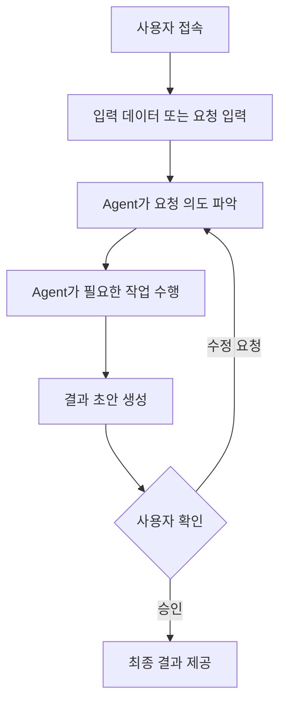
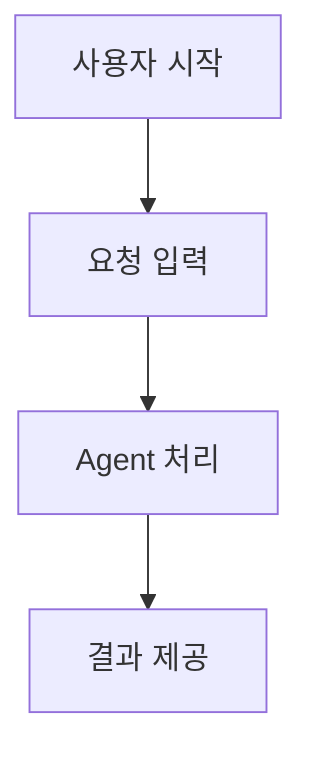
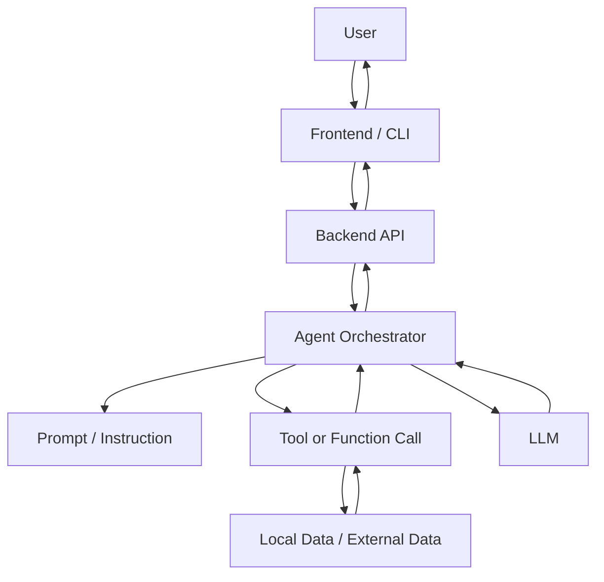
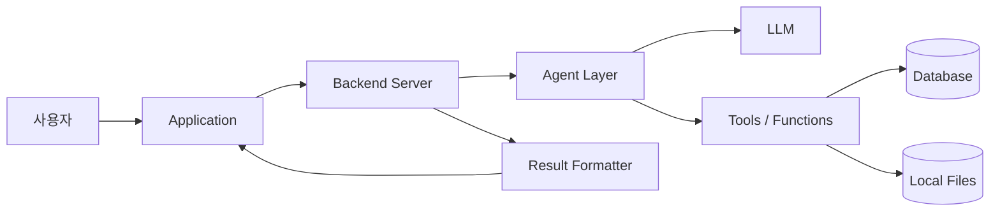

# [팀명] 프로젝트 기획서

> 제출 전 안내 문구는 삭제하고 제출하세요.  
> 본 문서는 **Agentic Workflow 데모 프로젝트**를 기획하기 위한 양식입니다.  
> `[필수]` 항목은 반드시 작성하고, `[권장]` 항목은 프로젝트 상황에 맞게 작성합니다.

---

## 0. 기본 정보

| 항목 | 내용 |
|---|---|
| 프로젝트명 |  |
| 팀명 |  |
| 참여자 |  |
| 작성일 |  |
| 버전 | v0.1 |

---

## 1. 문제 정의 및 프로젝트 개요

### 1.1 프로젝트 한 줄 정의 `[필수]`

> 우리는 **어떤 문제를 해결하기 위해 어떤 Agent/서비스를 만드는 팀인지** 한 문장으로 작성합니다.

- 작성 예시:  
  - `우리는 사용자가 복잡한 문서를 빠르게 이해하고 실행 가능한 업무 계획으로 바꿀 수 있도록 돕는 문서 분석 Agent를 개발한다.`

**작성 내용**

```text

```

---

### 1.2 서비스 한 줄 정의 `[필수]`

> 사용자가 봤을 때 이 서비스가 무엇인지 바로 이해할 수 있도록 작성합니다.  
> 프로젝트 관점이 아니라 **사용자 가치 관점**으로 설명하는 것이 중요합니다.

- 작성 예시:  
  - `사용자가 업로드한 문서를 분석해 핵심 요약, 문제 정의, 실행 계획을 자동으로 생성해주는 Agent 서비스`

**작성 내용**

```text

```

---

### 1.3 서비스 선정 배경 `[권장]`

> 왜 이 주제를 선택했는지 작성합니다.  
> 주제 선정 이유, 기존 방식의 불편함, 팀이 해결하고 싶은 문제의식 등을 포함할 수 있습니다.

**작성 내용**

```text

```

---

### 1.4 해결하려는 문제 `[필수]`

> 이 프로젝트가 해결하려는 핵심 문제를 작성합니다.  
> 단순히 “무엇을 만들 것인가”가 아니라, **왜 이 기능이 필요한가**를 중심으로 정리합니다.

| 구분 | 작성 내용 |
|---|---|
| 현재 상황 |  |
| 사용자가 겪는 문제 |  |
| 문제가 발생하는 이유 |  |
| 해결이 필요한 이유 |  |

---

### 1.5 대상 사용자 `[필수]`

> 이 Agent를 실제로 사용할 사용자를 정의합니다.  
> 대상 사용자가 명확해야 기능 수준, 화면 흐름, 응답 방식, 말투를 일관되게 설계할 수 있습니다.

| 항목 | 작성 내용 |
|---|---|
| 주요 사용자 |  |
| 사용자가 처한 상황 |  |
| 사용자의 목표 |  |
| 사용자의 어려움 |  |

---

### 1.6 핵심 가치 `[필수]`

> 이 프로젝트가 사용자에게 제공하는 가장 큰 이점을 작성합니다.  
> 모든 기능을 다 잘하려 하기보다, 이 서비스가 반드시 잘해야 하는 핵심 가치를 정합니다.

**작성 내용**

```text

```

---

## 2. 사용자 및 Agent 설계

### 2.1 타깃 사용자 페르소나 `[권장]`

> 대상 사용자를 조금 더 구체적으로 정의합니다.  
> 단, 페르소나가 너무 복잡해져서 실제 기능 설계와 연결되지 않으면 안 됩니다.

| 항목 | 작성 내용 |
|---|---|
| 이름/유형 |  |
| 연령대 |  |
| 직업/역할 |  |
| 사용 환경 |  |
| 주요 니즈 |  |
| 주요 불편함 |  |

---

### 2.2 Agent의 역할 `[필수]`

> Agent가 정확히 어떤 일을 대신 수행하는지 정의합니다.  
> 이 항목이 명확해야 Agent가 단순 챗봇인지, 추천 도구인지, 실행 도구인지 구분할 수 있습니다.

| 구분 | 작성 내용 |
|---|---|
| Agent가 수행하는 일 |  |
| Agent가 도와주는 범위 |  |
| Agent가 하지 않는 일 |  |
| 최종 산출물 |  |

---

### 2.3 Agent의 성격 및 톤앤매너 `[권장]`

> Agent가 사용자에게 어떤 방식으로 응답할지 작성합니다.  
> 역할 정의가 먼저이며, 톤앤매너는 사용 경험을 자연스럽게 만들기 위한 보조 요소입니다.

| 항목 | 작성 내용 |
|---|---|
| 말투 |  |
| 응답 길이 |  |
| 설명 방식 |  |
| 피해야 할 표현 |  |

---

### 2.4 Agent의 자율성 범위 `[필수]`

> Agent가 어디까지 스스로 판단하고 실행할 수 있는지 정의합니다.  
> 자율성 범위를 명확히 해야 기능 범위가 과도하게 커지는 것을 막을 수 있습니다.

| 단계 | Agent 수행 가능 여부 | 설명 |
|---|---:|---|
| 사용자 입력 해석 |  |  |
| 정보 검색/조회 |  |  |
| 데이터 분석 |  |  |
| 결과 요약 |  |  |
| 추천/판단 |  |  |
| 외부 작업 실행 |  |  |
| 최종 결정 |  |  |

**자율성 범위 요약**

```text
예: Agent는 정보 검색, 요약, 추천까지 수행한다. 다만 최종 실행 여부는 사용자가 승인해야 한다.
```

---

## 3. 핵심 기능 및 사용자 흐름

### 3.1 주요 사용자 시나리오 `[필수]`

> 사용자가 어떤 상황에서 이 서비스를 사용하는지 구체적으로 작성합니다.  
> 시나리오가 있어야 기능이 실제 사용 장면과 연결되고, 데모 및 테스트 기준도 명확해집니다.

| 시나리오 | 사용자 상황 | 사용자 입력 | Agent 응답/동작 | 기대 결과 |
|---|---|---|---|---|
| 시나리오 1 |  |  |  |  |
| 시나리오 2 |  |  |  |  |
| 시나리오 3 |  |  |  |  |

---

### 3.2 핵심 기능 정의 `[필수]`

> 실제로 구현할 기능을 정의합니다.  
> 핵심 기능을 명확히 잡아야 프로젝트 범위가 불필요하게 커지는 것을 막을 수 있습니다.

| 우선순위 | 기능명 | 기능 설명 | 입력 | 출력 | 필수 여부 |
|---:|---|---|---|---|---|
| 1 |  |  |  |  | 필수 |
| 2 |  |  |  |  | 필수 |
| 3 |  |  |  |  | 권장 |
| 4 |  |  |  |  | 선택 |

---

### 3.3 사용자 관점 워크플로우 `[필수]`

> 사용자가 서비스를 처음부터 끝까지 어떤 순서로 이용하는지 작성합니다.



**프로젝트에 맞게 수정한 워크플로우**



---

### 3.4 시스템 관점 워크플로우 `[권장]`

> 시스템 내부에서 어떤 순서로 동작하는지 작성합니다.  
> 구현에 필요한 수준까지만 정리하고, 불필요하게 복잡하게 작성하지 않습니다.



---

## 4. 기술 구현 설계

### 4.1 기술 스택 `[필수]`

> 무엇으로 만들 것인지 작성합니다.  
> 기술 스택이 정해져야 역할 분담, 구현 난이도, 개발 범위를 판단할 수 있습니다.

| 영역 | 사용 기술 | 선택 이유 |
|---|---|---|
| Frontend / UI |  |  |
| Backend |  |  |
| Agent Framework |  |  |
| LLM / Model |  |  |
| Database / Storage |  |  |
| 배포/실행 환경 |  |  |
| 기타 도구 |  |  |

---

### 4.2 시스템 아키텍처 `[권장]`

> 전체 시스템 구조를 작성합니다.  
> 처음부터 과도하게 상세하게 설계하기보다, MVP 구현에 필요한 정도로 작성합니다.



---

### 4.3 프롬프트 설계 전략 `[권장]`

> Agent의 역할, 입력 방식, 출력 형식을 어떻게 통제할지 작성합니다.

| 항목 | 설계 내용 |
|---|---|
| System Prompt 역할 |  |
| 사용자 입력 형식 |  |
| Agent 출력 형식 |  |
| 금지해야 할 응답 |  |
| 검증 방식 |  |

---

### 4.4 데이터 활용 및 기억 관리 `[권장]`

> Agent가 어떤 데이터를 활용하고, 필요한 경우 어떤 정보를 기억할지 작성합니다.

| 항목 | 작성 내용 |
|---|---|
| 입력 데이터 |  |
| 저장 데이터 |  |
| 임시 데이터 |  |
| 사용자별 기억 필요 여부 |  |
| 데이터 보관/삭제 기준 |  |

---

### 4.5 제약사항 및 예외 처리 `[필수]`

> 이번 프로젝트에서 하지 않을 것, 실패할 수 있는 상황, 예외 처리 방식을 작성합니다.

| 구분 | 내용 | 대응 방식 |
|---|---|---|
| 기술적 제약 |  |  |
| 데이터 제약 |  |  |
| 기능 범위 제외 |  |  |
| 잘못된 입력 |  |  |
| Agent 응답 실패 |  |  |
| 외부 API/도구 실패 |  |  |

---

## 5. 성과 평가 및 실행 계획

### 5.1 성공 지표 KPI `[권장]`

> 무엇을 성공으로 볼지 작성합니다.  
> 실무 수준의 정교한 지표가 아니더라도, 최소한의 성공 기준은 필요합니다.

| 지표 | 목표 기준 | 측정 방법 |
|---|---|---|
| 기능 완성도 |  |  |
| 응답 정확도 |  |  |
| 사용자 편의성 |  |  |
| 데모 가능 여부 |  |  |

---

### 5.2 MVP 범위 `[필수]`

> 이번 프로젝트에서 반드시 구현할 범위를 작성합니다.  
> 목표는 **로컬 환경에서 실행 가능한 Agentic Workflow 데모 프로젝트**를 완성하는 것입니다.

#### 반드시 구현할 것

- 
- 
- 

#### 이번 범위에서 제외할 것

- 
- 
- 

#### MVP 완료 기준

```text
예: 사용자가 입력을 넣으면 Agent가 의도를 파악하고, 최소 1개 이상의 도구/작업을 수행한 뒤, 정해진 형식의 결과를 반환한다.
```

---

### 5.3 단계별 개발 로드맵 `[필수]`

> 어떤 순서로 만들지 작성합니다.  
> 처음부터 모든 기능을 만들기보다 핵심 기능부터 순차적으로 구현합니다.

| 단계 | 목표 | 주요 작업 | 완료 기준 |
|---:|---|---|---|
| 1단계 | 기획 확정 | 문제 정의, 사용자, MVP 범위 확정 | 기획서 초안 완료 |
| 2단계 | 기본 구조 구현 | 프로젝트 구조, 기본 UI/API 구성 | 로컬 실행 가능 |
| 3단계 | Agent 기능 구현 | Prompt, Agent 로직, Tool 연결 | 핵심 시나리오 동작 |
| 4단계 | 예외 처리 및 개선 | 오류 처리, 출력 형식 개선 | 주요 실패 케이스 대응 |
| 5단계 | 데모 준비 | 발표 자료, 시연 흐름 정리 | 최종 데모 가능 |

---

### 5.4 기대 효과 `[권장]`

> 이 서비스가 사용자나 팀에게 어떤 변화를 만들 수 있는지 작성합니다.

**작성 내용**

```text

```

---

## 6. 최종 점검 체크리스트

| 체크 항목 | 확인 |
|---|---:|
| 프로젝트 한 줄 정의가 명확한가? | ☐ |
| 대상 사용자가 구체적인가? | ☐ |
| 해결하려는 문제가 기능보다 먼저 설명되어 있는가? | ☐ |
| Agent의 역할과 자율성 범위가 명확한가? | ☐ |
| 핵심 기능과 MVP 범위가 구분되어 있는가? | ☐ |
| 사용자 관점 워크플로우가 작성되어 있는가? | ☐ |
| 기술 스택과 구현 범위가 현실적인가? | ☐ |
| 제약사항과 예외 처리가 포함되어 있는가? | ☐ |
| 로컬 실행 가능한 데모 기준이 명확한가? | ☐ |

---

## 부록. 제출 전 삭제 권장 항목

아래 내용은 작성 가이드이므로, 최종 제출본에서는 삭제하거나 간단히 정리하는 것을 권장합니다.

- `[필수]`, `[권장]` 표시
- 작성 예시
- 안내 문구
- 빈 표 항목
- Mermaid 예시 중 실제 프로젝트와 맞지 않는 부분
