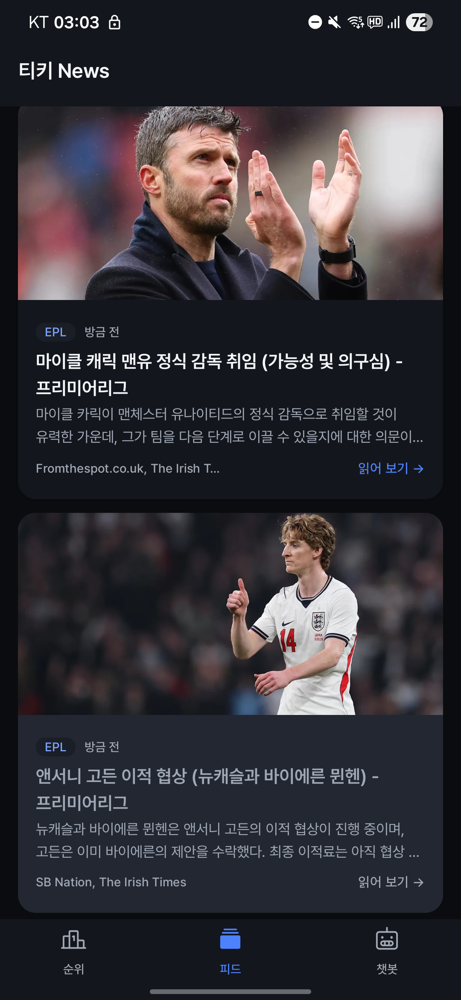
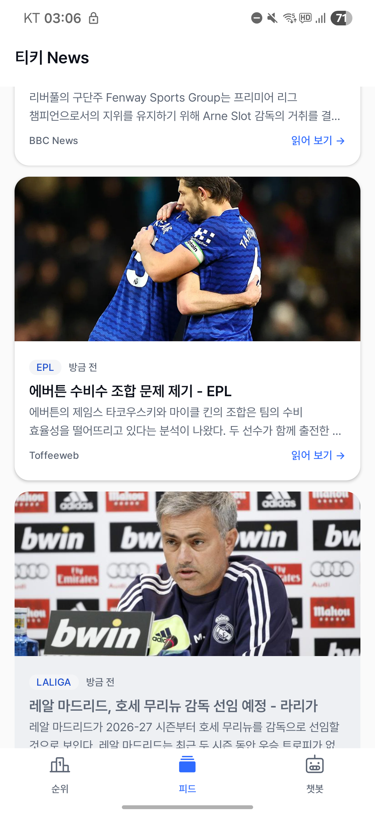
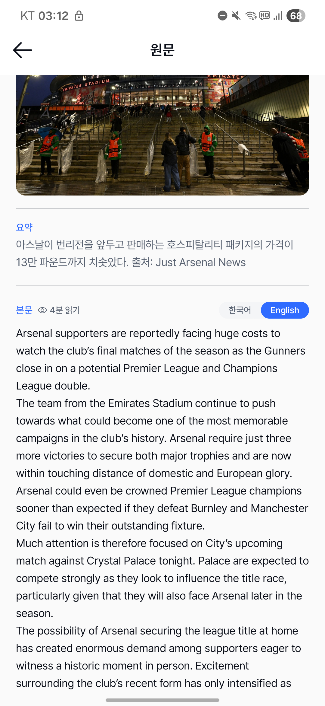
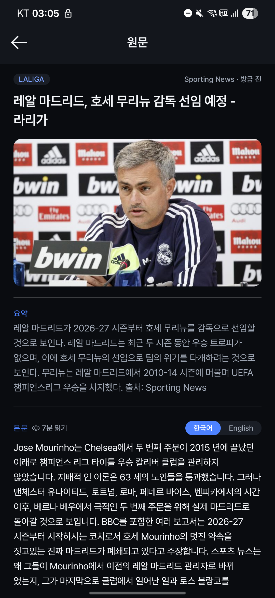
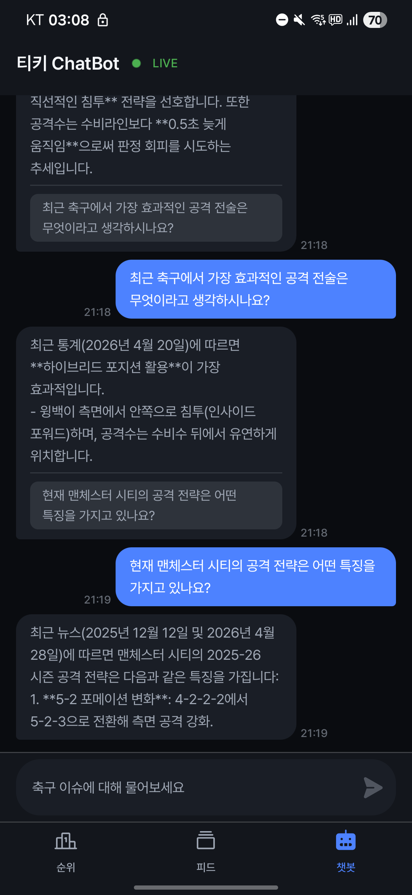
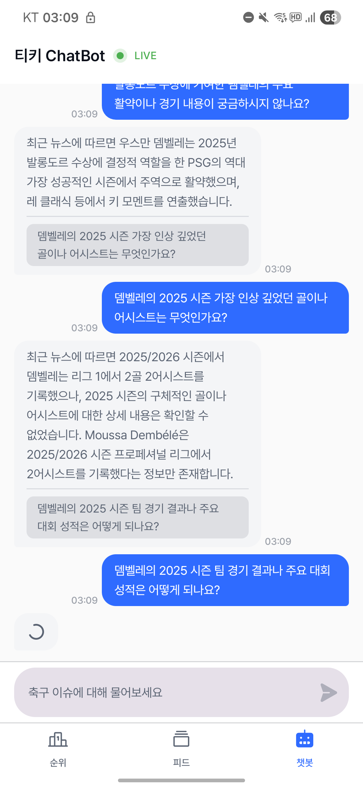
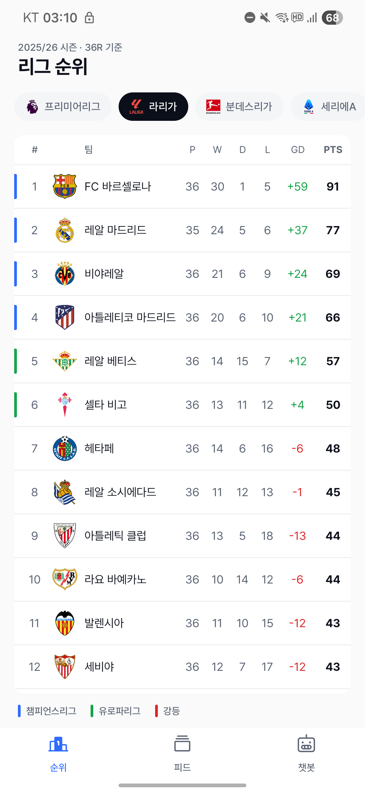
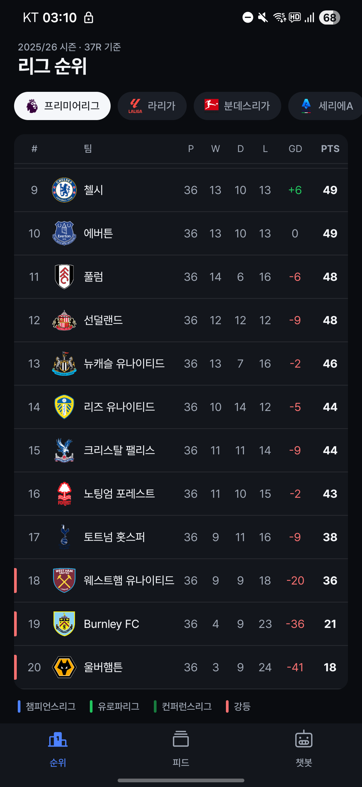

# TikiTalka ⚽

> 해외 축구 이슈 요약 및 AI 챗봇 서비스
> 화제성 높은 축구 뉴스를 큐레이션하고, AI와 실시간 티키타카(대화)를 제공하는 앱.

---

## 서비스 소개

TikiTalka는 두 가지 핵심 기능을 제공합니다.

| 기능 | 설명 |
|------|------|
| **뉴스 피드** | 5대 리그·챔피언스리그 등 해외 축구 뉴스를 자동 수집·AI 요약하여 화제성 순으로 제공 |
| **AI 티키타카** | Solar Pro 기반 축구 전문 AI와 대화형 Q&A, 최신 뉴스 실시간 검색 연동 |

---

## 스크린샷

| | |
|:---:|:---:|
| **뉴스 피드** | |
|  |  |
| **뉴스 상세** | |
|  |  |
| **AI 챗봇** | |
|  |  |
| **리그 순위** | |
|  |  |

---

## 레포지토리 구성

| 파트 | 설명 |
|------|------|
| `tikitalka-backend` | Spring Boot API 서버 + Python AI 서버 |
| `tikitalka-mobile` | KMP(Kotlin Multiplatform) 모바일 앱 |

---

## 백엔드

### 기술 스택

| 구분 | 기술 |
|------|------|
| API 서버 | Java 21, Spring Boot 4, Spring WebMVC, Spring WebFlux |
| AI 서버 | Python 3, FastAPI, Uvicorn |
| AI 모델 | Upstage Solar Pro (`solar-pro`), Solar Mini (`solar-1-mini-chat`) |
| 뉴스 수집 | NewsAPI.org, Jsoup (풀텍스트 크롤링) |
| 뉴스 검색 | Serper API (구글 웹 검색, organic 결과 기반) |
| 데이터 저장 | Google Sheets API (Chat 이력, News 피드) |
| 빌드 | Gradle (Kotlin DSL) |

---

### 프로젝트 구조

```
tikitalka-backend/
├── main.py                          # Python AI 서버 (FastAPI, port 8000)
├── requirements.txt
│
└── src/main/java/com/tikitalka/
    ├── BackendApplication.java
    │
    ├── controller/
    │   ├── NewsController.java           # GET /api/news, GET /api/news/{id}
    │   ├── ChatController.java           # POST /api/chat/message, GET /api/chat/history/{deviceId}
    │   ├── InternalNewsController.java   # POST /internal/api/news (뉴스 수동 등록)
    │   └── NewsTestController.java       # GET /internal/test/news/trigger|clear|raw-count (개발용)
    │
    ├── service/
    │   ├── NewsIntegrationService.java  # 뉴스 파이프라인 3단계 총괄
    │   ├── NewsCollectorService.java    # NewsAPI 수집 + Jsoup 풀텍스트 추출
    │   ├── SolarAiService.java          # Solar AI 단일/배치 분석
    │   ├── NewsService.java             # 뉴스 피드 조회 비즈니스 로직
    │   ├── ChatPipelineService.java     # 채팅 요청 → AI 서버 중계 → 저장
    │   └── ChatHistoryService.java      # 대화 이력 저장/조회
    │
    ├── scheduler/
    │   └── NewsScheduler.java           # 20분마다 뉴스 파이프라인 실행
    │
    ├── client/
    │   ├── AiServiceClient.java         # Python AI 서버 HTTP 클라이언트 인터페이스
    │   ├── RealAiServiceClient.java     # 실제 AI 서버 호출
    │   └── MockAiServiceClient.java     # 테스트용 Mock
    │
    ├── repository/
    │   ├── NewsRepository.java          # Google Sheets News 시트 CRUD
    │   ├── RawNewsRepository.java       # Google Sheets RawNews 시트 CRUD
    │   └── ChatRepository.java          # Google Sheets Chat 시트 CRUD
    │
    ├── model/
    │   ├── News.java                    # 최종 뉴스 피드 모델
    │   └── RawNews.java                 # 수집 원문 모델
    │
    ├── dto/                             # Request/Response DTO
    ├── config/                          # CORS, Google Sheets, WebClient 설정
    └── exception/
        └── GlobalExceptionHandler.java
```

---

### API 엔드포인트

#### Spring Boot (port 8080)

| Method | Path | 설명 |
|--------|------|------|
| `GET` | `/api/news` | 뉴스 피드 목록 (tag·page·size·sort 파라미터 지원, sort 기본값: `LATEST`) |
| `GET` | `/api/news/{id}` | 뉴스 상세 조회 |
| `POST` | `/api/chat/message` | AI 채팅 메시지 전송 |
| `GET` | `/api/chat/history/{deviceId}` | 디바이스별 대화 이력 조회 |

#### Python AI 서버 (port 8000)

| Method | Path | 설명 |
|--------|------|------|
| `POST` | `/chat` | 세션 기반 AI 채팅 처리 |

#### 내부 테스트용 (개발 환경)

| Method | Path | 설명 |
|--------|------|------|
| `POST` | `/internal/api/news` | 뉴스 수동 등록 |
| `GET` | `/internal/test/news/trigger` | 뉴스 파이프라인 수동 실행 (`?query=` 파라미터) |
| `GET` | `/internal/test/news/clear` | RawNews 시트 초기화 |
| `GET` | `/internal/test/news/raw-count` | RawNews 수집/처리 현황 조회 |

---

### 동작 흐름

#### 1. 뉴스 파이프라인 (20분 주기 자동 실행)

```
NewsScheduler (cron: 0 0/20 * * * *)
    │
    ▼
[1단계] NewsCollectorService
    │  NewsAPI.org에서 5대 리그 + UCL + UEL 기사 수집 (최대 30건)
    │  Jsoup으로 각 기사 원문 크롤링
    │  중복 URL 제거 후 RawNews 시트에 저장
    │
    ▼
[2단계] SolarAiService.analyzeNews() — 개별 기사 분석
    │  미처리 기사 최대 20건, 3건씩 병렬 처리
    │  Solar-1-mini → JSON {summary, tag, hotnessScore} 추출
    │  NOT_FOOTBALL 태그 기사는 필터링
    │  결과를 RawNews 시트에 업데이트
    │
    ▼
[3단계] SolarAiService.analyzeNewsBatch() — 주제 통합 스코어링
       72시간 이내 처리된 기사를 10건 청크 단위로 분석
       Solar-1-mini가 같은 경기/사건 기사를 하나의 이벤트로 병합
       hotnessScore 산정 및 기존 피드 업데이트/신규 추가
       결과를 News 시트에 반영
```

**뉴스 태그 분류**

| 태그 | 설명 |
|------|------|
| `EPL` | 잉글랜드 프리미어리그 |
| `LALIGA` | 스페인 라리가 |
| `BUNDESLIGA` | 독일 분데스리가 |
| `SERIE_A` | 이탈리아 세리에A |
| `LIGUE1` | 프랑스 리그앙 |
| `CHAMPIONS_LEAGUE` | UEFA 챔피언스리그 |
| `EUROPA_LEAGUE` | UEFA 유로파리그 |

---

#### 2. 채팅 흐름

```
모바일 앱
    │  POST /api/chat/message {deviceId, message}
    ▼
ChatController (Spring Boot :8080)
    │
    ▼
ChatPipelineService
    │  AiServiceClient → POST http://localhost:8000/chat
    │                         {session_id: deviceId, message}
    │
    ▼
Python AI 서버 (:8000) — call_upstage()
    │
    ▼
[Step 1] 라우팅 LLM 호출 (ROUTING_PROMPT)
    │  Solar Pro가 메시지를 분석해 뉴스 필요 여부 판단
    │  응답: "YES: <검색 키워드>" 또는 "NO"
    │
    ├─ YES → Serper API로 구글 웹 검색 (organic 결과)
    │         NEWS_SYSTEM_PROMPT + 검색 결과 컨텍스트와 함께 Solar Pro 호출
    │
    └─ NO  → SYSTEM_PROMPT로 Solar Pro 직접 호출 (뉴스 검색 없음)
    │
    ▼
응답 파싱: REPLY / SUGGEST 추출
    │
    ▼
ChatPipelineService
    │  ChatHistoryService → Chat 시트에 user/assistant 메시지 저장
    │
    ▼
모바일 앱
    {role, reply, suggestedQuestion, timestamp}
```

**AI 응답 포맷**

| 포맷 | 사용 조건 | 형식 |
|------|-----------|------|
| Format A | 뉴스 검색 결과 기반 답변 | `REPLY: ...` + `SUGGEST: ...` |
| Format B | 일반 축구 질문 | `REPLY: ...` + `SUGGEST: ...` |
| Format C | 비축구/인사 | `REPLY: ...` + `SUGGEST: NONE` |

---

### 데이터 저장 구조 (Google Sheets)

| 시트 | 컬럼 | 설명 |
|------|------|------|
| `News` | id, title, summary, tag, publishedAt, hotnessScore, originalContent, url, source, imageUrl | 최종 뉴스 피드 |
| `RawNews` | url, title, source, publishedAt, fullContent, summary, tag, isProcessed | 수집 원문 |
| `Chat` | deviceId, role, message, timestamp, suggestedQuestion | 대화 이력 |

---

### 환경 설정

```yaml
# application.yaml 주요 설정
external:
  news-api:
    key: ${NEWS_API_KEY}          # NewsAPI.org 키
    base-url: https://newsapi.org/v2
  solar-api:
    key: ${SOLAR_API_KEY}         # Upstage Solar API 키
    base-url: https://api.upstage.ai/v1/solar

ai:
  service:
    url: ${AI_SERVICE_URL:http://localhost:8000}  # Python AI 서버 URL
    mock: false

google:
  sheets:
    spreadsheet-id: ${SPREADSHEET_ID}
    credentials-path: ${GOOGLE_APPLICATION_CREDENTIALS}
```

```bash
# .env (Python AI 서버)
UPSTAGE_API_KEY=...     # Solar Pro 모델 키
NEWSDATA_API_KEY=...    # Serper API 키 (구글 뉴스 검색)
```

---

### 실행 방법

```bash
# Spring Boot API 서버
./gradlew bootRun

# Python AI 서버
pip install -r requirements.txt
uvicorn main:app --host 0.0.0.0 --port 8000 --reload
```

---

## 모바일 (tikitalka-mobile)

### 기술 스택

| 구분 | 기술 |
|------|------|
| 언어 | Kotlin |
| 멀티플랫폼 | KMP (Kotlin Multiplatform) + CMP (Compose Multiplatform) |
| 타겟 플랫폼 | Android (API 28+), iOS |
| 아키텍처 | Clean Architecture + MVI (Model-View-Intent) |
| DI | Koin 4.x |
| 네트워크 | Ktor Client 3.x |
| 순위 API | football-data.org v4 (`X-Auth-Token` 인증) |
| 번역 | Google ML Kit Translate (Android 온디바이스) |
| 이미지 로딩 | Coil 3.x (`SubcomposeAsyncImage`, SVG 지원) |
| 빌드 | Gradle (Kotlin DSL) |

---

### 프로젝트 구조

앱은 **`composeApp`** (UI 레이어)과 **`shared`** (비즈니스 로직) 두 모듈로 구성됩니다.

```
tikitalka-mobile/
├── composeApp/                          # UI 레이어 (Android + iOS 공통 Composable)
│   └── src/commonMain/
│       ├── kotlin/
│       │   ├── app/
│       │   │   └── App.kt               # NavHost, 3탭 NavigationBar (순위·피드·챗봇)
│       │   ├── navigation/
│       │   │   └── Screen.kt            # 화면 route 정의
│       │   ├── di/
│       │   │   └── AppModule.kt         # ViewModel Koin 등록
│       │   └── ui/
│       │       ├── standings/
│       │       │   └── StandingsScreen.kt  # 리그 순위 화면
│       │       ├── dashboard/
│       │       │   └── DashboardScreen.kt  # 뉴스 피드 화면
│       │       ├── issuedetail/
│       │       │   └── IssueDetailScreen.kt # 뉴스 상세 + 번역 화면
│       │       ├── chat/
│       │       │   └── ChatScreen.kt    # AI 챗봇 화면
│       │       └── theme/               # Material3 테마, 색상, 타이포그래피
│       └── composeResources/
│           └── drawable/                # 리그 아이콘 벡터 드로어블 (pl, pd, bl1, sa, fl1)
│
└── shared/                              # 비즈니스 로직 (Android + iOS 공유)
    └── src/
        ├── commonMain/kotlin/
        │   ├── domain/
        │   │   ├── model/               # Issue, ChatMessage, League, TeamStanding 도메인 모델
        │   │   ├── repository/          # IssueRepository, ChatRepository, StandingRepository 인터페이스
        │   │   ├── usecase/             # GetIssuesUseCase, GetIssueDetailUseCase, GetStandingsUseCase 등
        │   │   └── service/
        │   │       └── TranslationService.kt  # 번역 서비스 인터페이스
        │   │
        │   ├── data/
        │   │   ├── remote/api/          # IssueApi, ChatApi, StandingApi (Ktor)
        │   │   ├── remote/dto/          # IssueDto, ChatMessageDto, StandingDto
        │   │   ├── mapper/              # DTO → Domain Model 변환
        │   │   ├── repository/          # IssueRepositoryImpl, ChatRepositoryImpl, StandingRepositoryImpl
        │   │   └── TeamNameKorean.kt    # 5대 리그 80개+ 팀 한글 이름 매핑
        │   │
        │   ├── presentation/
        │   │   ├── standings/           # StandingsViewModel / State / Intent
        │   │   ├── dashboard/           # DashboardViewModel / State / Intent / Effect
        │   │   ├── issuedetail/         # IssueDetailViewModel / State / Intent / Effect
        │   │   └── chat/               # ChatViewModel / State / Intent / Effect
        │   │
        │   └── di/                      # NetworkModule, footballNetworkModule, RepositoryModule, UseCaseModule
        │
        ├── androidMain/kotlin/
        │   ├── data/service/
        │   │   └── AndroidTranslationService.kt  # ML Kit 온디바이스 번역
        │   └── di/PlatformModule.kt     # Android 플랫폼 DI 바인딩
        │
        └── iosMain/kotlin/
            ├── app/
            │   └── MainViewController.kt  # startKoinIos(baseUrl, footballApiKey)
            ├── data/service/
            │   └── IosTranslationService.kt  # 번역 미지원 스텁
            └── di/PlatformModule.kt     # iOS 플랫폼 DI 바인딩
```

#### 레이어별 의존성 방향 (DIP 적용)

```
UI (composeApp)
    └── Presentation (shared/presentation)
            └── Domain (shared/domain)  ←  Data (shared/data)
                    ↑
            인터페이스만 정의, 구현체는 Data 레이어가 담당
            의존성 연결은 Koin DI 모듈이 담당
```

---

### 화면 구성

| 화면 | 설명 |
|------|------|
| **리그 순위** (`StandingsScreen`) | 5대 리그 탭 전환, 팀 로고·한글 이름·W/D/L·승점 표시, 구역 색상 범례 (UCL·UEL·강등 등) |
| **뉴스 피드** (`DashboardScreen`) | 화제성 순 뉴스 카드 리스트, 썸네일 이미지, 태그·출처·시간·제목·요약, 무한 스크롤, 읽음 처리 |
| **뉴스 상세** (`IssueDetailScreen`) | 썸네일 이미지, 제목·요약·본문 표시, 예상 읽기 시간, 영어 원문 ↔ 한국어 번역 토글 |
| **AI 챗봇** (`ChatScreen`) | LIVE 인디케이터, Solar Pro 기반 축구 전문 AI 채팅, 추천 질문, 날짜 구분선 |

내비게이션 바 구성: **순위 → 피드 → 챗봇** (앱 진입 시 피드 화면)

---

### 동작 흐름

#### 1. 리그 순위 흐름

```
StandingsScreen 진입
    │  기본 선택: PREMIER_LEAGUE
    ▼
StandingsViewModel
    │  GetStandingsUseCase → StandingRepository → StandingApi
    │  GET https://api.football-data.org/v4/competitions/{leagueCode}/standings
    │  X-Auth-Token 헤더 (footballNetworkModule 별도 HttpClient)
    ▼
StandingsState(standings = {PL: [...]})
    │  리그별 캐싱 → 탭 전환 시 중복 요청 없음
    │  팀 이름 → 한글 변환 (TeamNameKorean.kt)
    ▼
순위 테이블 렌더링
    │  팀 로고: 로컬 벡터 드로어블 (painterResource)
    │  포지션 구역 색상: UCL(파랑)·UEL(주황)·UECL(초록)·강등(빨강)
    │  하단 범례: 리그별 동적 구성
    │
    ▼ 다른 리그 탭 선택 → StandingsIntent.SelectLeague
StandingsViewModel
    │  캐시 없으면 API 호출, 있으면 즉시 렌더링
    │  레이스 컨디션 방지: 응답 수신 시 selectedLeague 일치 여부 확인
```

#### 2. 뉴스 피드 흐름

```
앱 진입 (피드 탭)
    │
    ▼
DashboardScreen
    │  LaunchedEffect → DashboardIntent.LoadIssues
    ▼
DashboardViewModel
    │  GetIssuesUseCase → IssueRepository → IssueApi
    │  GET /api/news?sort=hotness&size=20
    ▼
DashboardState(issues = [...])
    │
    ▼
뉴스 카드 리스트 렌더링
    │  imageUrl 있을 때: 카드 상단 180dp 썸네일 (SubcomposeAsyncImage)
    │  읽음 처리: 클릭한 카드 톤 다운 (surfaceContainerLow)
    │  스크롤 하단 도달 → DashboardIntent.LoadMore (무한 스크롤)
    │  카드 클릭 → DashboardEffect.NavigateToDetail(issueId)
    ▼
IssueDetailScreen (상세 화면으로 이동)
```

#### 3. 뉴스 상세 + 번역 흐름

```
IssueDetailScreen 진입 (issueId 전달)
    │
    ▼
IssueDetailViewModel.load(issueId)
    │  GetIssueDetailUseCase → GET /api/news/{id}
    ▼
IssueDetailState(issue = Issue(...))
    │  imageUrl 있을 때: 제목 하단 220dp 이미지 (둥근 모서리)
    │  예상 읽기 시간 표시 (본문 길이 기반)
    │  기본 언어: English (원문 표시)
    │
    ▼ 사용자가 '한국어' 탭 선택
IssueDetailIntent.SelectLanguage(KOREAN)
    │
    ▼
IssueDetailViewModel.selectLanguage()
    │  이전 번역 Job 취소 (레이스 컨디션 방지)
    │  isTranslating = true
    │  TranslationService.translate(originalContent, KOREAN)
    │      Android: ML Kit 온디바이스 번역 (모델 자동 다운로드)
    │      iOS: 미지원 (Result.failure 반환)
    ▼
IssueDetailState(translatedContent = "번역된 한국어 본문")
    │
    ▼
번역된 본문 표시 (실패 시 Snackbar 에러 표시)
```

#### 4. AI 챗봇 흐름

```
ChatScreen 진입
    │  타이틀 옆 LIVE 인디케이터 (InfiniteTransition 펄싱 애니메이션)
    │  LaunchedEffect → ChatIntent.LoadHistory (deviceId 기반)
    │  GET /api/chat/history/{deviceId}
    ▼
대화 이력 표시 (날짜 구분선, 시간 포맷 포함)
    │
    ▼ 사용자 메시지 입력 → ChatIntent.SendMessage
ChatViewModel
    │  낙관적 업데이트: 사용자 메시지 즉시 State에 추가
    │  POST /api/chat/message {deviceId, message}
    ▼
서버 응답 수신
    │  {role, reply, suggestedQuestion, timestamp}
    ▼
ChatState(messages = [...], suggestedQuestions = [...])
    │
    ▼
AI 응답 버블 + 추천 질문 버튼 렌더링
```

---

### 환경 설정

football-data.org API 키는 각 플랫폼의 로컬 설정 파일에 넣습니다. 이 파일들은 `.gitignore`로 관리됩니다.

```properties
# Android: local.properties
football.api.key=YOUR_API_KEY
```

```swift
// iOS: iosApp/iosApp/LocalConfig.swift (LocalConfig.swift.example 참고)
enum LocalConfig {
    static let baseUrl = "http://localhost:8080/"
    static let footballApiKey = "YOUR_API_KEY"
}
```

---

### 실행 방법

```bash
# Android (Android Studio)
# 1. local.properties에 football.api.key 설정
# 2. composeApp 모듈 선택 후 Run

# iOS (Xcode)
# 1. iosApp/iosApp/LocalConfig.swift.example을 LocalConfig.swift로 복사 후 키 설정
# 2. iosApp/iosApp.xcodeproj 열고 Run
```
