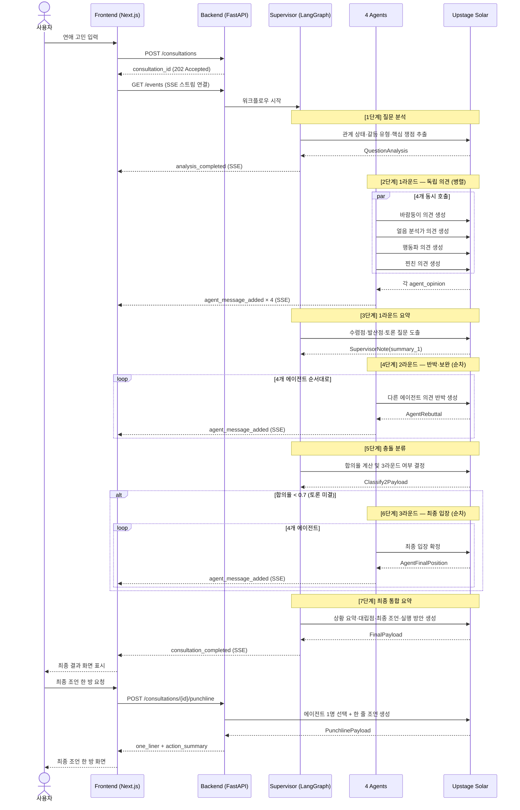
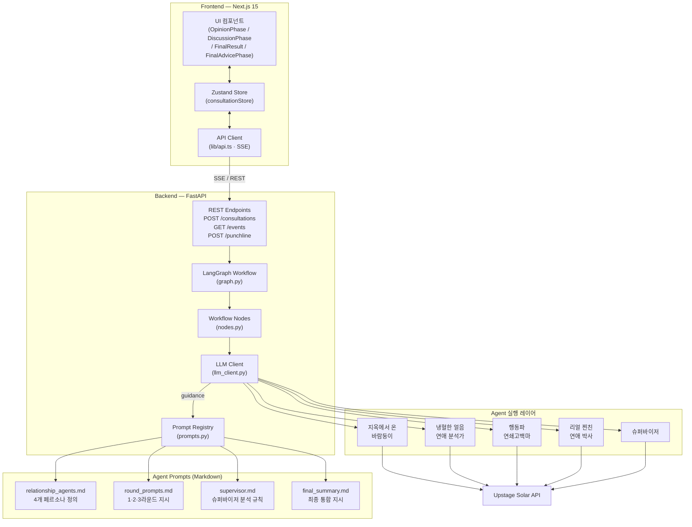
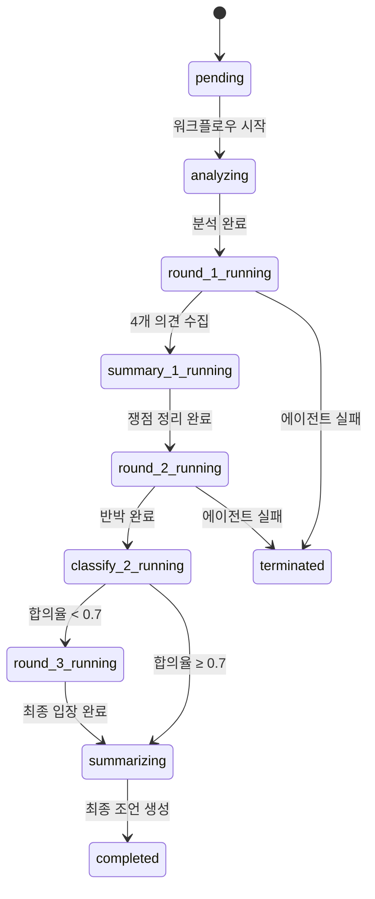

# 멀티 Agent 기반 연애 상담 PoC

---

## 목차

1. 프로젝트 소개
2. 기획 / 협업
3. 시퀀스 다이어그램
4. 시스템 아키텍처
5. 데모 설명
6. 데모

---

## 1. 프로젝트 소개

### 한 줄 정의

> 사용자의 연애 고민을 입력하면, 서로 다른 연애관을 가진 4명의 AI Agent가 의견을 내고 3라운드 토론을 거쳐 최종 조언을 제공하는 멀티 Agent 기반 연애 상담 서비스

### 왜 만들었나

| 문제 | 설명 |
|------|------|
| 단일 관점 한계 | 기존 챗봇은 하나의 답변만 제공 — 다양한 해석 비교 불가 |
| 연애 고민의 주관성 | 정답이 없고 사람마다 판단 기준이 다름 |
| 토론 과정 부재 | 결론만 보여줄 뿐 에이전트 간 논쟁 과정이 보이지 않음 |
| 재미 부족 | 단조로운 Q&A 형식 → 몰입감 없음 |

### 핵심 가치

- 4가지 상반된 연애관이 하나의 고민을 서로 다른 시각으로 해석
- 반박·보완이 오가는 토론 과정을 실시간으로 공개
- 슈퍼바이저가 토론 전체를 종합해 균형 잡힌 최종 조언 제공
- 친구들과 수다 떠는 듯한 재미 경험

### Agent 페르소나

| Agent | 연애관 | 어투 |
|-------|--------|------|
| 지옥에서 온 바람둥이 | 바람·양다리 직접 경험자. "설렘 없으면 다 거짓말." | 능글맞고 경험 기반, 반인륜적이지만 공감 가는 |
| 냉혈한 얼음 연애 분석가 | 행동 데이터·패턴·주도성 비율로만 판단. 감정은 노이즈 | 건조한 단문, 수치·확률 표현 |
| 행동파 연쇄고백마 | 17번 차여도 18번째 준비 중. 고민 = 손해 | 에너지 폭발, 느낌표, 지금 당장 |
| 리얼 찐친 연애 박사 | 다들 생각하는데 아무도 안 해주는 말을 한다 | 반말, ㅋㅋ, 솔직하고 불편한 직격 |

### 기술 스택

| 영역 | 기술 |
|------|------|
| Frontend | Next.js 15, TypeScript, Tailwind CSS, Zustand, Framer Motion |
| Backend | FastAPI, LangGraph, Python |
| AI | Upstage Solar (claude-sonnet 계열) |
| 통신 | Server-Sent Events (SSE) — 실시간 스트리밍 |
| 배포 | Docker Compose |

---

## 2. 기획 / 협업

### 팀 구성 (44조)

| 이름 | 역할 |
|------|------|
| 박준혁 | 백엔드 워크플로우, LangGraph 오케스트레이션, 에이전트 프롬프트 |
| 김민우 | 프론트엔드 UI/UX, 컴포넌트 설계 |
| 김준서 | 프론트엔드 상태관리, API 연동 |
| 신현성 | 백엔드 API, 스키마 설계 |
| 임지빈 | 에이전트 프롬프트 설계, 토론 로직 |

### 협업 방식

- **브랜치 전략**: 기능별 브랜치 → `wangc/integrate-existing-branches` → `main` 순서로 통합
  - `feature/fastapi-langgraph-backend` — 백엔드 워크플로우
  - `feature/protocol_v1` — 스키마/프로토콜
  - `jibin/prompts` — 에이전트 프롬프트
  - `junseo` — 프론트엔드
- **실행 스크립트**: `scripts/run-backend.ps1` / `scripts/run-frontend.ps1` — 환경 상관없이 원클릭 실행
- **문서화**: `agents/prompts/`, `agents/workflows/` 에 프롬프트·플로우 가이드 분리 관리

### MVP 범위

포함:
- 사용자 고민 입력 → 3라운드 토론 → 최종 조언 전체 워크플로우
- 4개 Agent 페르소나 구현 및 실시간 SSE 스트리밍
- 상담 히스토리 저장 및 조회

제외:
- 외부 검색, RAG, 외부 API 정보 활용
- 사용자 계정/인증
- 실제 배포 (PoC 로컬 데모 목적)

---

## 3. 시퀀스 다이어그램



---

## 4. 시스템 아키텍처

### 컴포넌트 구성



### 워크플로우 상태 흐름



---

## 5. 데모 설명

### 시나리오

> "요즘 썸남이 답장이 늦는데 밀당인지 관심이 식은 건지 모르겠어."

### 화면 흐름

| 단계 | 화면 | 주요 내용 |
|------|------|-----------|
| 1 | 입력 화면 | 고민 텍스트 입력 → 상담 시작 |
| 2 | 로딩 | 에이전트 분석 중 애니메이션 |
| 3 | 1라운드 의견 | 4명의 에이전트 카드 + 각자 조언 |
| 4 | 토론 (2·3라운드) | 에이전트 간 반박·보완 채팅 형식 |
| 5 | 최종 리포트 | 상황 요약 / 의견 갈린 지점 / 주요 쟁점 / 최종 조언 / 행동 방안 |
| 6 | 최종 조언 한 방 | 선택된 에이전트 풀스크린 + 한 줄 명령 + 에이전트 목소리 행동 요약 |

### 주요 기술 포인트

- **실시간 SSE 스트리밍**: 에이전트가 발언을 완료할 때마다 즉시 화면에 추가 (전체 완료 대기 없음)
- **페르소나 유지 강제**: 각 에이전트 호출 시 `_AGENT_VOICE` 딕셔너리로 핵심 어휘·논리·톤을 task에 직접 주입
- **자기 반박 방지**: 2라운드에서 에이전트 자신의 1라운드 발언을 input으로 전달 → 입장 뒤집기 방지
- **동적 3라운드 분기**: 슈퍼바이저 합의율이 0.7 미만일 때만 3라운드 실행

---

## 6. 데모

**실행 방법**

```bash
# 백엔드
.\scripts\run-backend.ps1

# 프론트엔드 (별도 터미널)
.\scripts\run-frontend.ps1
```

**접속**: http://localhost:3000

**API 문서**: http://localhost:8000/docs
