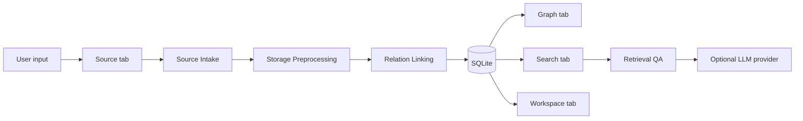
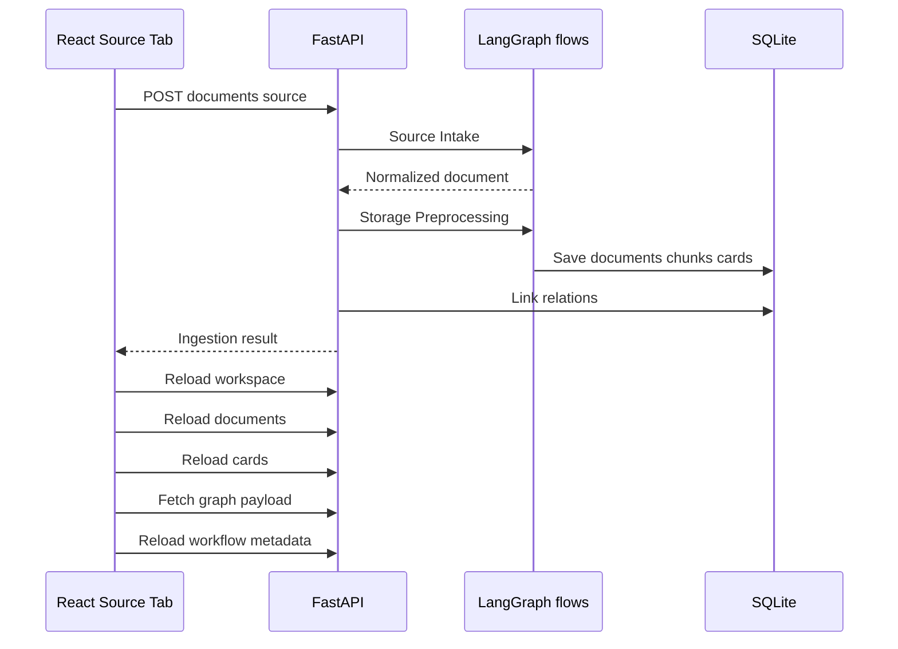

# Ideation Context Hub

흩어진 기획 자료를 **원문 → chunk → Knowledge Card → relation → 근거 기반 검색/답변** 흐름으로 바꾸는 프로젝트입니다. 회의록, Notion, GitHub, Slack, Linear, 웹 문서, 파일 업로드에서 나온 맥락을 SQLite에 저장하고, React UI에서 그래프와 검색으로 다시 탐색합니다.

> [!TIP]
> 먼저 `npm run setup` → `npm run dev`만 실행한 뒤, 브라우저에서 `Load Samples`를 눌러 전체 흐름을 보는 것이 가장 빠릅니다. 현재 샘플 로드는 기존 workspace를 지우고 시연용 초기 상태로 되돌립니다.

## 한눈에 보기

| 영역 | 현재 코드 기준 |
|---|---|
| Backend | FastAPI, Pydantic, SQLite repository |
| Frontend | Vite, React, shadcn UI, lucide-react |
| Workflow | LangGraph `StateGraph` |
| Local graph apps | `source_intake`, `storage_preprocessing`, `qa_assistant` |
| 주요 UI 탭 | `Graph`, `Source`, `Search`, `Workspace` |
| 기본 저장소 | `sqlite:///./data/ideation_context_hub.sqlite3` |
| 선택 연동 | Upstage, Claude, Codex OAuth, Notion, GitHub, Slack, Linear, MCP |

## 프로젝트 흐름



이 앱은 “새 아이디어를 대신 생성”하기보다, 이미 있는 자료에서 결정, 근거, 리스크, 질문을 카드로 뽑아 팀이 다시 사용할 수 있게 만드는 쪽에 초점이 있습니다.

## 화면 구성

| 탭 | 역할 |
|---|---|
| `Graph` | Graph Studio, Obsidian Graph, LangGraph Flow를 보여줍니다. 저장된 문서, 카드, 관계를 시각적으로 탐색합니다. |
| `Source` | 소스 입력, 파일 업로드, 수동 카드 입력만 담당합니다. 긴 텍스트를 넣으면 처리 단계가 화면에 표시됩니다. |
| `Search` | 저장된 카드/chunk/relation을 기반으로 일반 검색과 LLM 질의를 실행합니다. |
| `Workspace` | workspace 생성, 수정, 삭제, sample reset을 담당합니다. |

> [!IMPORTANT]
> `Load Samples`는 append가 아니라 reset입니다. 현재 DB의 workspace를 삭제한 뒤 `ICH Demo Workspace`와 시연용 source들을 다시 넣습니다.

## 소스 저장이 진행되는 방식

긴 문서를 저장하면 한 번의 POST 안에서 여러 단계가 순서대로 실행됩니다.



> [!NOTE]
> “SQLite 저장 후 그래프 갱신이 느리다”처럼 보일 수 있지만, 실제로는 POST 안에서 normalize, chunking, card extraction, relation linking까지 동기 실행됩니다. 특히 카드가 많이 누적되면 relation linking이 신규 카드와 기존 카드들을 비교하므로 시간이 늘어납니다.

Source 탭의 진행 UI는 다음 단계로 쪼개서 표시합니다.

```text
Validate input → Source intake → Chunk & filter → Card extraction
→ Relation linking → SQLite persist → Reload workspace/documents/cards
→ Fetch graph payload → Reload workflow metadata → Render update
```

## 로컬 E2E 실행

### 1. 의존성 설치

```powershell
npm run setup
```

설치되는 항목은 Python requirements, `frontend` npm packages, LangGraph CLI/graph dependencies입니다.

### 2. 전체 앱 실행

```powershell
npm run dev
```

브라우저에서 엽니다.

```text
http://127.0.0.1:5173
```

Vite는 `/api`와 `/health`를 `http://127.0.0.1:8000`으로 proxy합니다.

### 3. 빠른 시연

1. `Workspace` 탭에서 `Load Samples`를 누릅니다.
2. `Graph` 탭에서 문서-카드-관계를 확인합니다.
3. `Source` 탭에서 긴 text를 붙여넣고 저장합니다.
4. 진행 단계가 `SQLite persist`, `Fetch graph payload`, `Render update`까지 넘어가는지 확인합니다.
5. `Search` 탭에서 `GraphDB를 제외한 이유와 보완 방법은?` 같은 질문을 실행합니다.

> [!WARNING]
> `Load Samples`는 로컬 DB를 초기화합니다. 작업 중인 실제 workspace를 보존해야 한다면 먼저 DB 파일을 따로 백업하세요.

## 자주 쓰는 명령어

| 목적 | 명령어 | 비고 |
|---|---|---|
| 전체 실행 | `npm run dev` | FastAPI + Vite + LangGraph apps |
| 웹 앱만 실행 | `npm run dev:web` | FastAPI + Vite |
| Backend만 실행 | `npm run backend:dev` | `127.0.0.1:8000` |
| Frontend만 실행 | `npm run frontend:dev` | `127.0.0.1:5173` |
| LangGraph apps 실행 | `npm run langgraph:dev` | `graphs/*/langgraph.json` |
| Frontend build | `npm run frontend:build` | `frontend/dist` 생성 |
| Frontend lint | `npm run frontend:lint` | ESLint |
| 전체 pytest | `npm run backend:test` | Python test suite |
| 포트 정리 | `npm run dev:stop` | dev server, pytest, Playwright MCP 정리 |

## 코드 구조

```text
app/
  api/             FastAPI routers
  workflows/       LangGraph StateGraph flows
  services/        parsing, extraction, retrieval, relation, LLM, connectors
  repositories/    SQLite persistence
  models/          Pydantic schemas
frontend/src/
  App.tsx          top-level state and tab orchestration
  components/      graph panels, source panel, shadcn UI wrappers
  lib/             API client, samples, source-panel config
graphs/
  source_intake/
  storage_preprocessing/
  qa_assistant/
tests/
  API, workflow, parsing, retrieval, connector, UI contract tests
```

## 주요 API

| 기능 | Endpoint |
|---|---|
| workspace CRUD | `/api/workspaces` |
| source 저장 | `/api/workspaces/{workspace_id}/documents/source` |
| file upload | `/api/workspaces/{workspace_id}/documents/upload` |
| card CRUD | `/api/workspaces/{workspace_id}/cards` |
| graph payload | `/api/workspaces/{workspace_id}/graph` |
| keyword search | `/api/workspaces/{workspace_id}/search?q=...` |
| LLM search | `/api/workspaces/{workspace_id}/search/llm` |
| Q&A history | `/api/workspaces/{workspace_id}/qa/history` |
| quality review | `/api/workspaces/{workspace_id}/reviews/run` |
| workflow registry | `/api/workflows` |

FastAPI 문서는 서버 실행 후 `http://127.0.0.1:8000/docs`에서 확인할 수 있습니다.

## 환경 변수

기본 개발과 테스트는 API key 없이 가능합니다. 외부 fetch나 LLM 답변이 필요할 때만 `.env`를 만듭니다.

```powershell
Copy-Item .env.example .env
```

| 변수 | 용도 |
|---|---|
| `ICH_DATABASE_URL` | SQLite DB 경로 |
| `UPSTAGE_API_KEY` | Upstage Solar 답변 생성 |
| `ICH_LLM_PROVIDER` | `auto`, `upstage`, `claude`, `codex_oauth`, `local` |
| `ANTHROPIC_API_KEY` | Claude provider |
| `ICH_CODEX_OAUTH_TOKEN` | Codex/OpenAI OAuth provider |
| `ICH_NOTION_TOKEN` | Notion 자동 fetch |
| `ICH_GITHUB_TOKEN` | GitHub file/issue/pull 자동 fetch |
| `ICH_SLACK_TOKEN` | Slack thread 자동 fetch |
| `ICH_LINEAR_TOKEN` | Linear issue 자동 fetch |
| `ICH_MCP_SERVER_URL`, `ICH_MCP_ACCESS_TOKEN` | MCP resource fetch |
| `LANGGRAPH_DEPLOYMENT_URL`, `LANGSMITH_API_KEY` | 외부 LangGraph deployment |

## 검증 기준

```powershell
python -m pytest tests/test_web_ui.py
npm run frontend:lint
npm run frontend:build
```

전체 회귀가 필요할 때는 아래를 실행합니다.

```powershell
npm run backend:test
```

> [!TIP]
> UI 문자열을 과하게 고정하는 테스트는 유지보수 비용이 큽니다. 현재 `tests/test_web_ui.py`는 React shell 제공, 핵심 탭/진행 흐름 계약, sample reset 계약만 확인하도록 압축했습니다.

## 데이터와 개인정보

이 앱은 원본 문서와 evidence quote를 저장합니다. 회의록, 인터뷰 메모, AI 대화에는 개인정보나 외부 비밀 정보가 포함될 수 있으므로 업로드 전에 확인하세요.

현재 범위에는 조직 단위 권한 관리, 자동 비식별화, 감사 로그 정책은 포함되어 있지 않습니다.
