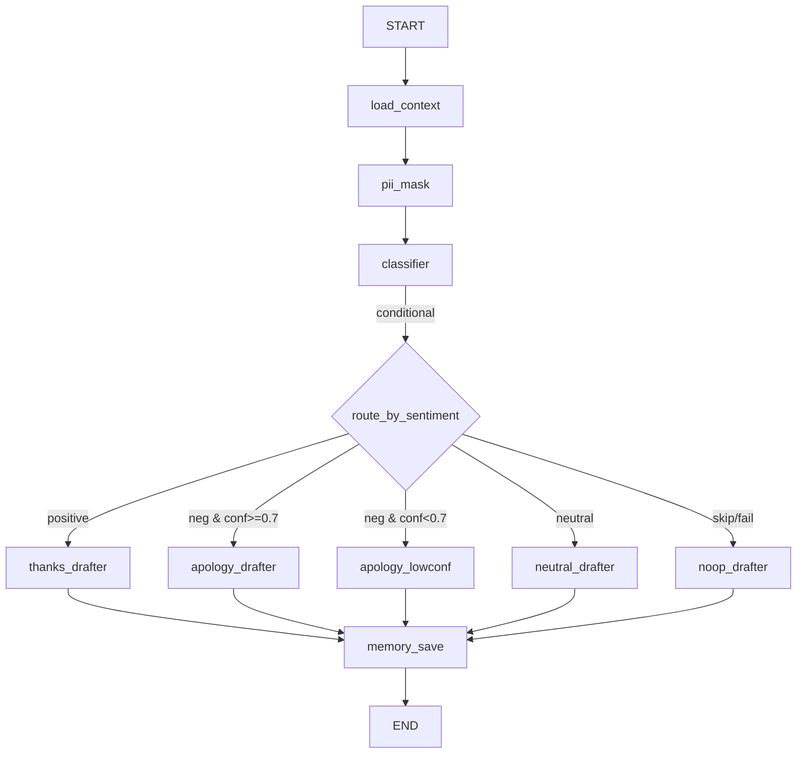

<!--
  review-ops-agent — 1장 포스터 본문
  발표 양식 슬라이드(이미 준비됨)의 포스터 페이지에 옮겨 사용
  레이아웃: 표지 → 3 컬럼 (문제/가치 · workflow · 핵심 기능) → 푸터 (tech + 학습 포인트 + 시연 링크)
-->

# review-ops-agent — 매장 톤을 기억하는 멀티 Agent

> **LangGraph 6 surface** 위에 multi-tenant Memory + Conditional Router + SQL Tool + ReAct + Streaming + Structured Output
>
> *쓸수록 우리 가게답게, 누적된 부정 리뷰는 데이터로*

**SOMA 17기 · 57조** — 박세민 · 박세원 · 박준하 · 유혁진 · 윤성민

---

## 1. 문제 + 가치 — *왼쪽 컬럼*

### 우리가 푸는 문제

- **답글 부담** — 매일 5~15건 리뷰, 답글은 미루다 일주일 묵힘. 부정 리뷰는 단어 선택이 어려워 더 미뤄짐
- **반복 불만 인지 실패** — "대기 길어요" 가 4주 연속 들어와도, 매주 새로 본 듯한 응대 반복
- **'우리 가게답지 않은' 답글** — 일반 LLM 답글의 위화감. 톤이 매장 특성과 다르면 사장님이 매번 다시 씀

### 우리 가설

> 카페·식당 5만 곳 × 주 10건 리뷰 = **주 50만 건의 응대 부담**.
> 1인 운영자 비중 60%+. *데이터로 기억하는 비서* 가 필요.

### 한 줄 가치 제안

> **리뷰 운영 시간 30분 → 5분.** 사장님은 *검토만* 하면 끝.

### 차별점 3

| | 차별점 | 핵심 작동 |
|---|---|---|
| **1** | 매장 톤 학습 | 사장 수정 → `diff_hint` 자동 구조화 JSON → 다음 답글 prompt 주입 |
| **2** | 다세션 분석 | 4주 SQL `bind_tools` 집계 → TOP 3 + 점검 체크리스트 |
| **3** | 다층 안전성 | conditional `apology_lowconf` 분기 + `safety_filter` 사전 치환 + PII 정규식 마스킹 |

---

## 2. Agent Workflow — *중앙 컬럼 (큰 비주얼)*

### 메인 graph — 1 review = 1 invocation

**구조 요약**: 노드 6 · conditional edge **5분기** · trace 자동 누적

### + Batch graph (별도)
`pattern_aggregator (bind_tools SQL) → checklist_generator`
3-step trace: `llm_decide → sql_tool → llm_summarize`

### + Chat agent (별도)
`create_react_agent` ReAct loop · **5 tools** (read 3 + write 2)
매장별 closure 격리 → tool 호출 시 `place_id` 자동 주입

### Memory namespace 구조

| Namespace | 내용 | 쓰기 시점 |
|---|---|---|
| `(place_id, "metadata")` | 매장명·메뉴·가격대·톤 선호 | 첫 진입 / seed |
| `(place_id, "tone_samples")` | 사장 채택/수정 답글 (최근 N건 few-shot) | [복사]/[수정 저장] 시 |
| `(place_id, "feedback")` | diff_hint (`{dimension, before, after}`) | 수정 직후 비동기 |

### LangGraph 6 surface 모두 적용

> **Conditional Edge** · **Memory Store** · **Streaming** · **Tool calling** · **ReAct prebuilt** · **State Reducer**

---

## 3. 핵심 기능 3가지 — *오른쪽 컬럼*

### 일상 처리 — 메인 graph
1건 리뷰가 들어오면 6 노드를 통과 → 분류 카드 + 답글 초안 + [복사]/[수정] 버튼.

**예시 시나리오**:
> 부정 리뷰 "대기 너무 길어요" 입력 → 1초 후 카드 등장 → 신뢰도 0.55 → `apology_lowconf` 자동 → "불편 드려 죄송합니다. 어떤 부분이 불편하셨는지 알려주시면..." 보수적 답글

**사용자 가치**: 위험 표현 자동 회피, 사장은 수정만

---

### 회고 분석 — Batch graph
주말에 새로고침 → 4주 부정 카테고리 TOP 3 + 점검 체크리스트 4~5개.

**예시 시나리오**:
> 일요일 밤 클릭 → batch graph trace 3 step → "대기 12회 / 가격 5회 / 위생 3회" + "피크타임 인력 1명 추가 검토", "빨대 제공 동선 점검" 등 To-Do

**사용자 가치**: 반복되는 불만이 *비로소 보이는* 가시화

---

### 채팅 비서 — ReAct chat agent
"오늘 새 리뷰 3건 분석해줘" → 자연어로 5개 tool 호출 → 응답.

**예시 시나리오**:
> "이 답글 톤 샘플로 추가해줘 — 리뷰: ... / 답글: ..." → `add_owner_reply` tool → Memory Store write → "다음 답글 prompt few-shot 으로 자동 주입"

**사용자 가치**: UI 학습 없이 *말로* 매장 운영

---

## 4. Tech Stack · 학습 포인트 · 시연 — *푸터 (가로 풀폭)*

### Tech Stack

| 영역 | 선택 |
|---|---|
| 언어 | Python 3.11 |
| Agent | LangGraph 0.2 + LangChain core + `langchain-upstage` |
| LLM | Upstage Solar Pro 2 (전 노드, Ko-MT-Bench 81.0) |
| 구조화 출력 | `response_format={"type": "json_schema", strict=True}` |
| UI | Streamlit (단일 프로세스) |
| 저장소 | SQLite (관계형 사실) + LangGraph Memory Store (JSON dump 영속) |
| 패키징 | uv + Makefile · Docker compose |

### 주요 학습 포인트 (자체 회고)

- **Multi-graph 분리**: 한 거대 graph 보다 *목적별 3 graph* (main / batch / chat) 가 conditional 폭발 방지 + 학습 surface 노출
- **Conditional edge trace 한계**: edge 함수가 state 변경 못 함 → classifier 노드 끝에서 *라우터 결정을 예측* 해 trace 에 emit
- **Defense in depth**: prompt-level "환불·할인 금지" + 후처리 `safety_filter` 사전 치환 둘 다 — LLM 일탈 대비
- **Multi-layer dedup**: 구조화 JSON (`dimension`) + LLM judgment + heuristic fallback 3겹 — "미안해요 선호" vs "죄송합니다 선호" 모순 자동 merge
- **Mock provider env 라우팅**: 함수 시그니처 보존하며 API 키 없이 e2e 동작 — 데모·CI 안정성

### 시연 · 링크

> **데모 URL**: `<demo-url-placeholder>`
> **GitHub**: `<repo-url-placeholder>`
> **QR code**: `<qr-placeholder>` *(우하단 정사각 placeholder)*

SOMA 17기 57조 · 2026 · Upstage Solar API powered
