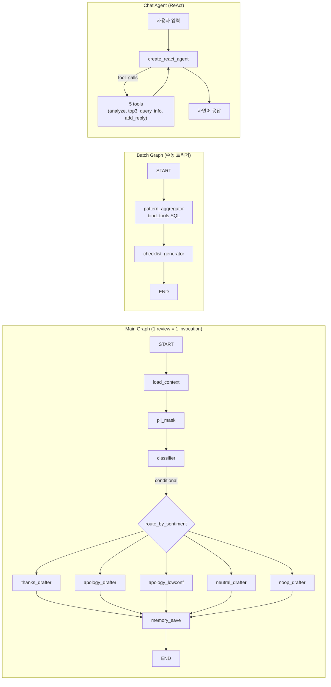

<!--
  review-ops-agent — 발표 슬라이드 데크 (7장 · 총 310s ≈ 5분 10초)
  본문만 — 발표 양식 슬라이드(이미 준비됨)에 옮겨 사용
  슬라이드 구분: `---` · H1 = 슬라이드 제목 · HTML 주석 = 시간 예산 + 메타
  발표 페이싱: 한국어 분당 ~280자 가정, 슬라이드당 bullet 3~5개
-->

<!-- 시간: 15s · 슬라이드: 표지 -->

# review-ops-agent

> 매장 톤을 기억해 점점 우리 가게답게 답글, 누적 부정 리뷰로 점검 체크리스트까지

**한 줄로**: LangGraph multi-tenant Memory + Conditional Router + SQL Tool 위에 *쓸수록 우리 가게다워지는* 멀티 Agent.

**SOMA 17기 · 57조**

박세민 · 박세원 · 박준하 · 유혁진 · 윤성민

Powered by LangGraph 0.2 + Upstage Solar Pro 2 (Ko-MT-Bench 81.0)

---

<!-- 시간: 45s · 슬라이드: 서비스 선정 배경 -->

# 왜 이 서비스인가

소상공인 1인 운영자가 매일 마주하는 3가지 문제.

- **시간 부족** — 매일 평균 5~15건 리뷰, 답글은 미루다 1주 묵힘
- **단어 선택의 어려움** — 부정 리뷰에 "환불·할인 약속" 같은 *위험 표현* 실수, 법적·매장 정책 분쟁 위험
- **반복 불만 인지 실패** — 비슷한 불만이 4주 반복돼도 *데이터로* 잡히지 않음 → 같은 응대를 매번 반복

### 시장 가설

> 카페·식당 5만 곳, 1곳당 주 10건 리뷰 = **주 50만 건의 응대 부담**.
> 직접 응대 비중 80% 추정 (개인 운영 기준).

### 우리 목표

> **리뷰 운영 30분 → 5분.** 사장님이 *검토만* 하면 되는 상태로 1차 가공.

---

<!-- 시간: 40s · 슬라이드: 핵심 가치 (차별점 3) -->

# 핵심 가치 — 차별점 3가지

| 가치 | 우리 솔루션 | 작동 방식 |
|---|---|---|
| **매장 톤 학습** | 사장 수정본 → `diff_hint` 자동 추출 → 다음 답글 prompt 에 주입 | 구조화 JSON 추출 `{dimension, before, after, hint}` |
| **다세션 패턴 분석** | 4주 SQL 집계 + LLM 자유 생성 → TOP 3 + 점검 체크리스트 | `bind_tools` 로 LLM 이 SQL args 직접 결정 |
| **다층 안전성** | 신뢰도 기반 보수 분기 + 위험 표현 후처리 + PII 정규식 마스킹 | classifier `risk_flag` → low-conf 분기 + `safety_filter` 사전 치환 |

**"쓸수록 우리 가게답다"** — Memory Store `(place_id, kind)` namespace 로 매장별 영속 격리. 다른 매장 톤이 절대 섞이지 않음.

---

<!-- 시간: 50s · 슬라이드: 서비스 핵심 기능 3가지 -->

# 서비스 핵심 기능

세 가지 시간 축으로 매장 운영을 돕는다.

### 일상 — 리뷰 1건 → 답글 초안 → 사장 수정 저장
> 메인 graph · 6 노드 (load_context → pii_mask → classifier → route → drafter → memory_save)
> *예시*: 부정 리뷰 입력 1초 → 카드 등장 (분류 + 답글 초안) → 사장 [복사]/[수정] 클릭 → 다음 답글에 톤 반영

### 회고 — 주말 누적 분석 → TOP 3 + 체크리스트
> Batch graph · 2 노드 (pattern_aggregator → checklist_generator) + SQL tool
> *예시*: 일요일 밤 클릭 → "대기 12회 / 가격 5회 / 위생 3회" + "피크타임 인력 1명 추가 검토" 같은 To-Do 4개

### 대화 — 자연어 요청으로 매장 운영
> ReAct chat agent · 5 tools (`analyze_new_reviews`, `get_top_complaints`, `query_reviews`, `get_store_info`, `add_owner_reply`)
> *예시*: "오늘 새 리뷰 3건 분석해줘" → tool 호출 → "긍정 1·부정 2 처리. 답글 초안은 인박스 카드에서 확인하세요"

---

<!-- 시간: 40s · 슬라이드: 왜 LangGraph 인가 -->

# Agent Workflow — 왜 LangGraph 인가

LangGraph 6 surface 를 *깊이 있게* 활용했다.

| Surface | 우리 구현 | 어디서 보이는지 |
|---|---|---|
| **Node + State reducer** | `Annotated[list, add]` 로 trace 자동 누적 | 카드 `🔍 graph trace` expander |
| **Conditional Edge** | sentiment × confidence 4 갈래 분기 | 사이드바 진행 ✓ + trace `route_by_sentiment` |
| **Cross-thread Memory Store** | `(place_id, kind)` namespace, JSON dump | 사이드바 톤 샘플·힌트 expander |
| **`bind_tools`** | LLM-driven SQL tool calling | batch trace 3-step `llm_decide → sql → summarize` |
| **`create_react_agent` prebuilt** | 5줄로 챗 agent + 5 tool | 💬 매장 비서 dialog |
| **Streaming (`updates`)** | 노드 단위 진행 | 사이드바 ✓/⏳/⏸ progress |

**6 surface 모두 한 데모에 시연** — 평가위원이 *trace 한 번 펼치면* 다 보임.

---

<!-- 시간: 60s · 슬라이드: Agent Workflow 구성 -->

# Agent Workflow — 3 graph 한눈에

### 분기 조건 (route_by_sentiment)

| sentiment | confidence | → 다음 노드 |
|---|---|---|
| positive | — | `thanks_drafter` |
| neutral | — | `neutral_drafter` |
| negative | ≥ 0.7 | `apology_drafter` |
| negative | < 0.7 | `apology_drafter_lowconf` (보수적 prompt) |
| lang_skip / classification_failed | — | `noop_drafter` (사장 직접 작성) |

노드 9개 · 분기 5종 · tool 6개 · surface 6개 모두 시연

---

<!-- 시간: 60s · 슬라이드: Agent Workflow 시연 (최종 슬라이드) -->

# Agent Workflow 시연 — 한 흐름 4 시나리오

### 1. 새 리뷰 5건 처리 — *Conditional Router*
> **입력**: 사이드바 `🔁 새 리뷰 5건 가져오기` 클릭
> **과정**: 노드 ✓ progress (load → pii → classifier → route → drafter → save) × 5건
> **결과**: 카드 5장. 신뢰도 0.55 부정 1건은 `apology_lowconf` 자동 분기 → 보수적 답글

### 2. 답글 수정 → 톤 학습 — *Memory Store*
> **입력**: 답글의 "미안해요" → "죄송합니다" 로 수정 저장
> **과정**: Solar 가 구조화 JSON `{dimension: 사과표현, before: 미안해요, after: 죄송합니다}` 추출 → 기존 hint 와 dedup → merge
> **결과**: 사이드바 톤 힌트 expander 에 "미안해요 보다 죄송합니다 선호" 1건만 남음 (중복 정리)

### 3. TOP 3 + 체크리스트 — *Tool calling*
> **입력**: `📊 TOP 3 + 체크리스트 새로고침` 클릭
> **과정**: batch graph trace 3 step (`llm_decide → sql_tool → llm_summarize`)
> **결과**: "대기시간 12회 / 가격 5회 / 위생 3회" + 점검 To-Do 4개

### 4. 💬 매장 비서 — *ReAct prebuilt*
> **입력**: "오늘 새 리뷰 3건 분석해줘"
> **과정**: chat agent ReAct loop → `analyze_new_reviews(3)` tool 호출 → main graph 3 회 실행
> **결과**: "긍정 1·부정 2 처리. 인박스에서 카드 확인하세요" 자연어 응답
